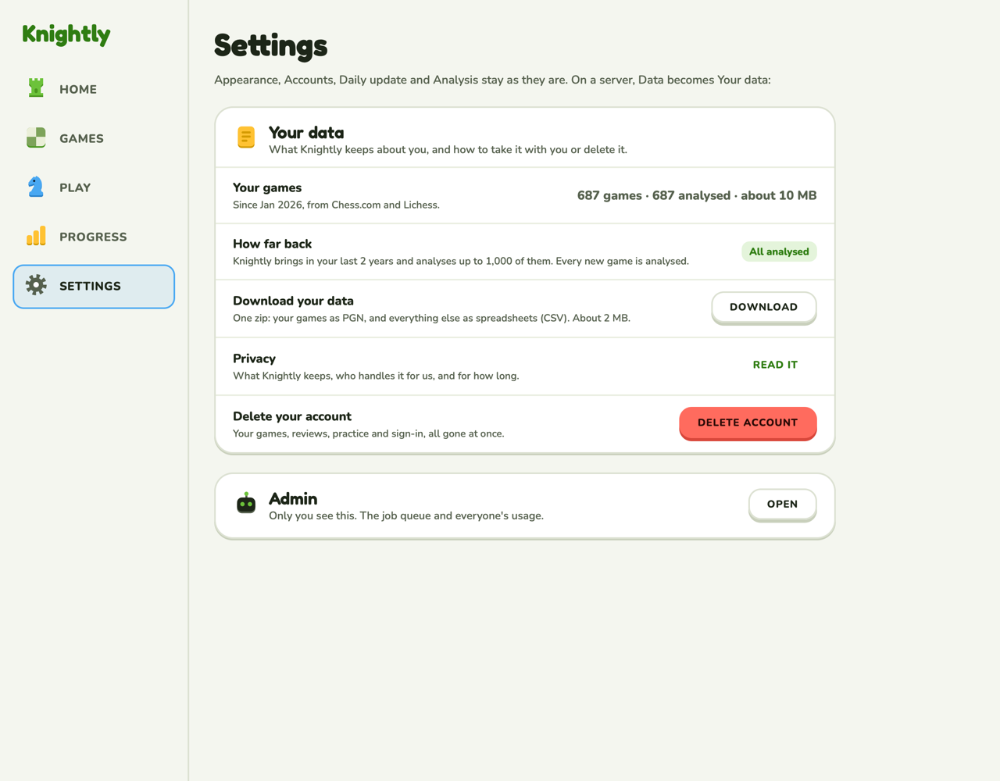
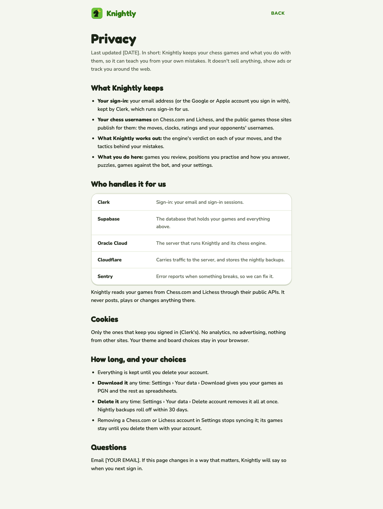
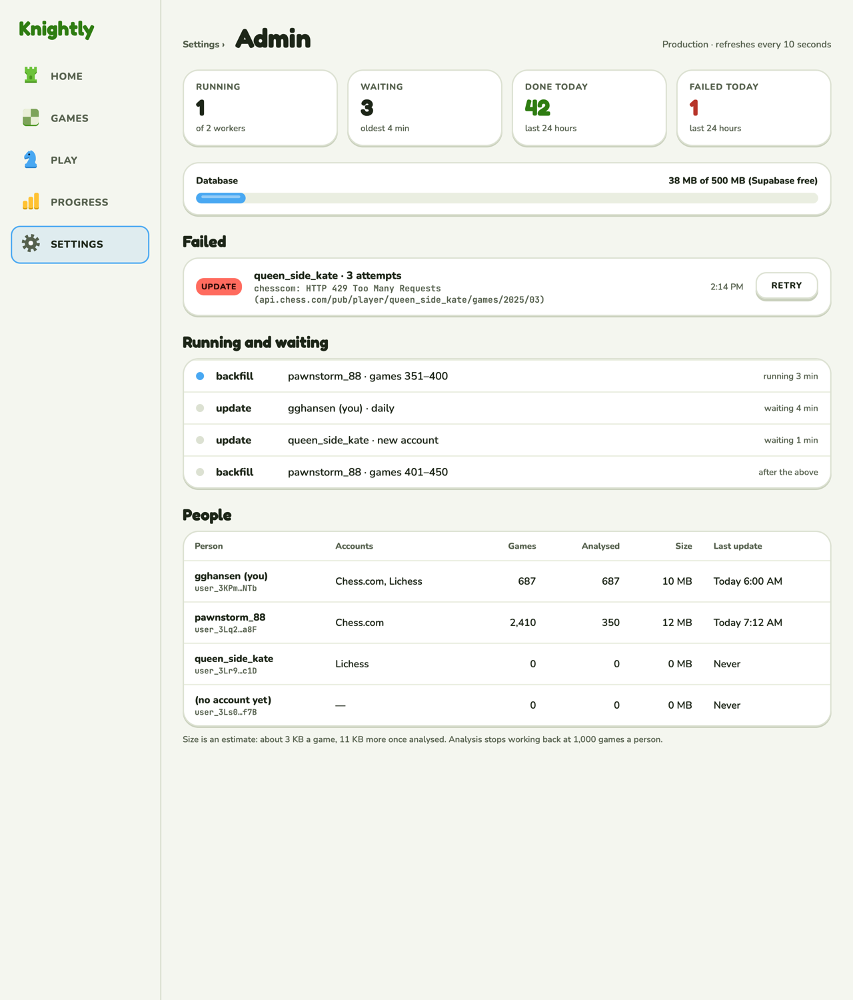

# Your data, Privacy, Admin

What a signed-in person can see and do with their data, the public privacy page, and the
admin page.

**Code:** `web/src/pages/settings.tsx` (Your data), `pages/privacy.tsx`, `pages/admin.tsx`,
`components/confirm-dialog.tsx`. **Built**
([#64](https://github.com/hunterrhansen/knightly/pull/64), backend
[#62](https://github.com/hunterrhansen/knightly/pull/62)). Rules in design.md › Screens.

| Privacy | Admin |
| --- | --- |
|  |  |

## Your data

On a server, Settings › Data becomes **Your data**: your games and their size, how far back a
server reaches (the last 2 years, up to 1,000 analysed), Download (a zip), Privacy, and
Delete account. Delete opens a `ConfirmDialog` where you type "delete". The page is dimmed with
the `scrim` token. Admins also see an Admin card at the bottom.

## Privacy

Public at `/privacy`, outside sign-in, and linked under the sign-in form. The logo and Back,
then a reading column: what's kept, who handles it, cookies, your choices, and the contact
(from `KNIGHTLY_CONTACT`). The canvas draft has `[YOUR EMAIL]` / `[DATE]` placeholders.

## Admin

Admins only, at `/settings/admin`. Stat tiles (running, waiting, done today, failed today), the
database as a bar out of Supabase's 500 MB, failed jobs with their error in mono and Retry, the
queue (a sky dot while running), and a table of people (accounts, games, analysed, size, last
update). Refreshes every 10 seconds. The people on the canvas are examples.

## Decisions (Oct 8)

1. Delete account: a dialog where you type "delete".
2. Admin: a card at the bottom of Settings, admins only.
3. Privacy: this draft, public.
4. "How far back" on a server: the last 2 years, up to 1,000 analysed.
5. On a server, Settings › Data becomes Your data.
