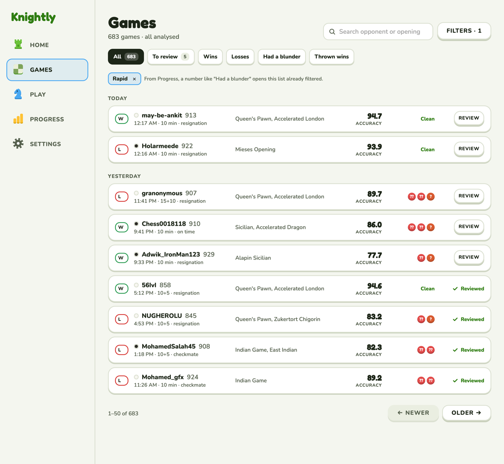
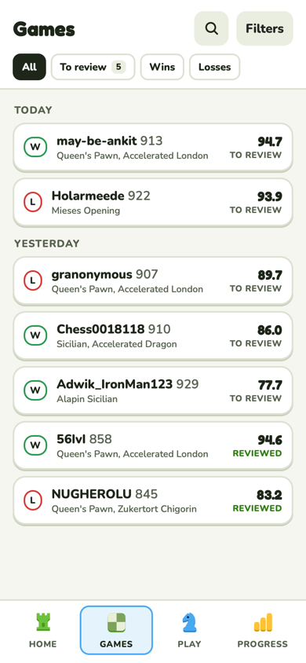

# Games

The library of every game, and the way into a review.

**Code:** `web/src/pages/games.tsx`, `components/filter-pill.tsx`, `components/game-bits.tsx`.
**Built.** Rules in design.md › Screens › Games.

| Desktop | Phone |
| --- | --- |
|  |  |

## Layout

- **Header:** "Games", the count ("683 games · all analysed"), search (opponent or opening) and
  Filters (with the number of filters on).
- **Quick filters:** All, To review, Wins, Losses, Had a blunder, Thrown wins, each with its
  count. The chosen one is ink.
- **Active filter chips:** a filter that arrived from Progress (a number like "Had a blunder"
  links here) shows as a removable chip.
- **Day groups** (Today, Yesterday, dates) in your time zone. One card per game: result badge
  (W/L/D), your color, opponent and rating, time, time control and how it ended, the opening,
  accuracy, up to three blunder/mistake badges or "Clean", then Review or ✓ Reviewed.
- Paging: "1–50 of 683", Newer / Older.

## Decisions

- **Kept from before:** search, the Speed / Color / Result / Date filters (now behind Filters),
  the KPI links from Progress, accuracy, how it ended, paging.
- **New:** quick filters with To review first; badges per game; review status per game.
- **To review** = analysed, not reviewed, played in the last 7 days. Finish review sets the
  game's reviewed flag.
