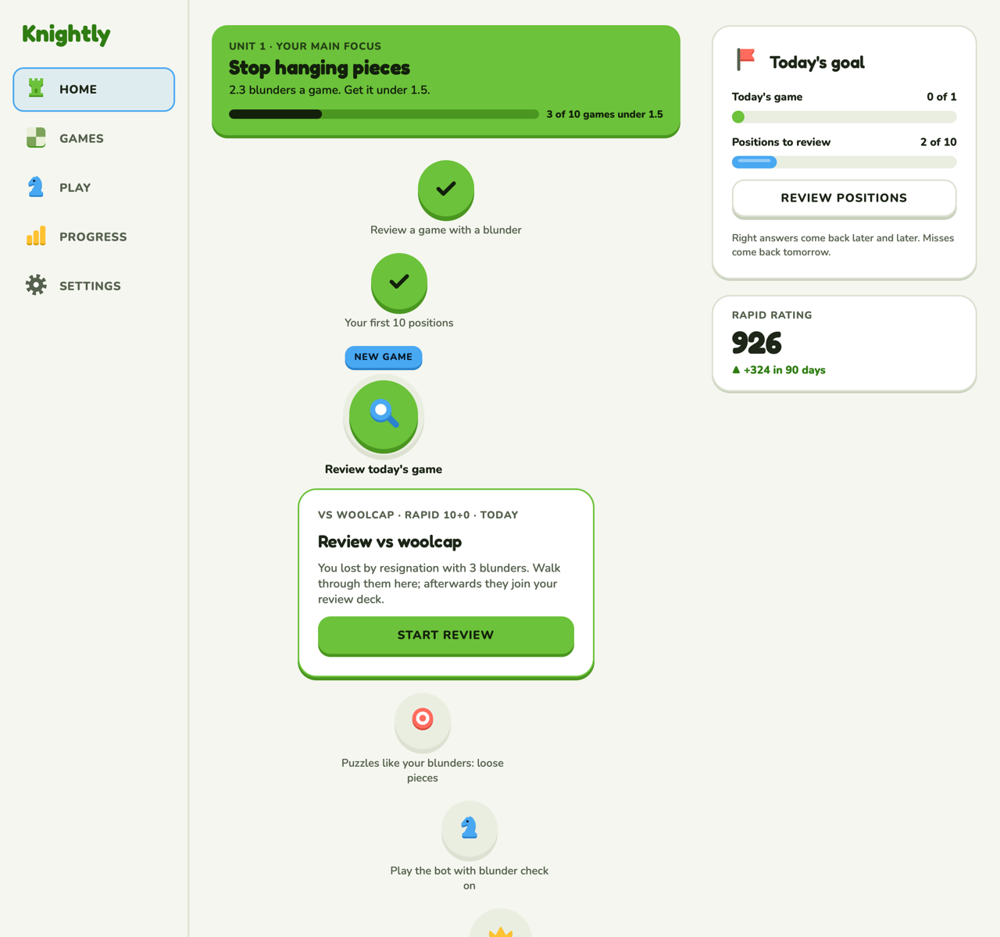
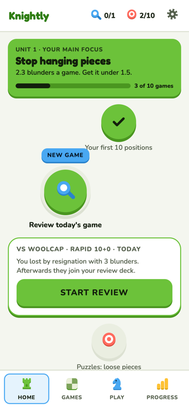
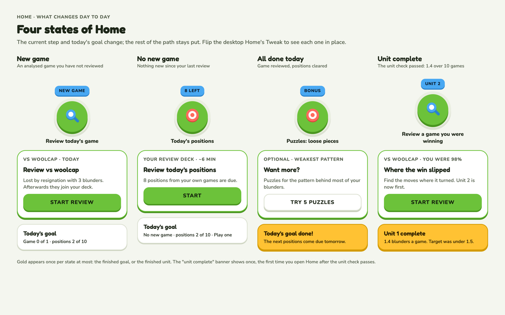

# Home

Today's goal and your path. The first thing you see after sign-in: what to do today, in order,
and why it's the thing that will help most.

**Code:** `web/src/pages/home.tsx`, `components/home-cards.tsx`, `components/path-node.tsx`;
data from `/api/home` and `units.py`. **Built.** Rules in design.md › Home.

| Phone | The four states |
| --- | --- |
|  |  |

## Layout

- **Unit 1 banner** (brand fill): your weakest number as a goal ("Stop hanging pieces: 2.3
  blunders a game. Get it under 1.5.") and its unit check as a bar ("3 of 10 games under 1.5").
- **The path**, one column of `PathNode`s: done steps (green check), the current step (ringed,
  a sky tag like NEW GAME, the only beacon on the page), then locked steps and the unit check's
  crown. All units are listed below the current one, in order, weakest first.
- **Lesson card** under the current step: what it is, from which game, why ("You lost by
  resignation with 3 blunders. Walk through them here; afterwards they join your review deck"),
  and one brand button (outline for the optional bot game).
- **Right column:** Today's goal (a brand bar for today's game, a sky bar for positions, and
  Review positions) and the rating card.
- **Phone:** the goal moves into the top bar as two counters (`0/1` review, `2/10` positions);
  the path and lesson card fill the screen; the tab bar along the bottom.

## States

| State | What changes |
| --- | --- |
| New game | Today's newest unreviewed game is the current step: "Review vs woolcap". |
| No new game | The current step is today's positions. |
| All done | Today's goal turns gold ("Today's goal done"); the optional bot game stays. |
| Unit done | A gold "Unit complete" banner, shown once per unit; the next unit becomes Unit 1. |

Gold appears once at most per view.

## Decisions

- **Path first (option A),** over a page of unit cards (B). B's unit cards live on Progress.
- Your newest unreviewed game becomes the current step. Clicking a step opens its lesson card.
- **Units come from your own numbers**, weakest first, and re-sort as they change. A unit is
  done when its number hits the target.
- **Today's goal** = today's newest game + due positions, capped at 10. No backlog pile after
  days off.
- Every step is something the app already does: review a game, review your own positions,
  puzzles for the tactic you blunder most (5 a day, near your puzzle rating), play the bot with
  Blunder check on. **No points, streaks or leagues.**
- Learning new openings is parked. If openings ever become your weakest number, an Openings unit
  would drill your own lines.

## How learning works

Every mistake, miss and blunder where one move was clearly better becomes a position card.
Practice schedules them with FSRS (see [practice.md](practice.md)). After each answer: a
one-line why and when it comes back. Mistakes are tagged by tactic (loose piece, fork, back
rank…); the weakest tactic adds Lichess puzzles of that type to the path.
