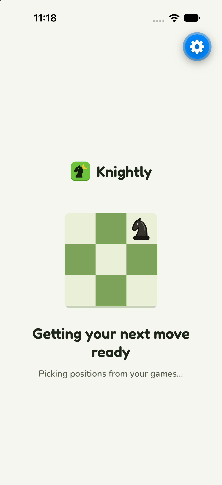

# Mobile loading

**Code:** `mobile/src/components/knight-loader.tsx`, `mobile/src/lib/loading-motion.ts`.
**Built:** October 10, 2026. Approved direction: Knight hop.

This is the actual native component in Expo Go on the iPhone 18 Pro simulator,
shown through a temporary loading-only route. The route was removed after verification.
The blue gear is Expo Go's development overlay, not a Knightly control.

## Layout and behavior

- Full-screen waits show the existing Knightly logo above a centered 168px mini
  board, a short Fredoka heading, and a Nunito line saying what is loading.
  Before fonts load, startup uses the system font and a text wordmark.
- The board uses `boardLight`, `boardDark` and the solid `lip` ledge. The knight
  is the same black `Piece` as the playing board. Colors follow the theme tokens.
- The knight visits all eight perimeter squares of the 3×3 board. Every landing
  is a legal knight move: two squares along one axis, then one perpendicular.
  Each move holds 700ms, takes 200ms for the long leg and 100ms for the short leg.
  The eight-second tour closes at its starting square without a reset jump.
- Translation runs through Reanimated CSS keyframes. No diagonal travel, scale
  bounce, sound, fake percentage or countdown. The illustration is decorative;
  assistive technology receives one loading label and a busy state.
- Reduced motion (read at app startup) shows the knight still on its starting square. Backgrounding
  pauses the animation; unmounting removes it. Full-screen waits scroll when
  text scale or screen height requires it.

## Where it appears

Startup, connecting to the server, opening the Clerk account, Home's initial
path, Practice's first positions, the first Games fetch, and opening a replay
share this component with task-specific wording. Practice retains its exit and
footer actions; advancing an existing position retains its existing stable board.
Games pagination keeps its small inline wait. Errors retain their error text and
retry controls, and loaded content appears immediately without waiting for the tour.

## Verification

The native preview rendered in the iPhone simulator with the knight on different
squares over time. The same component rendered in React Native Web at 320×460
with wrapped copy and vertical scrolling. Tests verify legal landing differences,
axis-aligned legs, board bounds, timing order, scaling and a continuous loop.
Mobile lint, typecheck, all 73 tests and final iOS/web exports pass. The temporary
preview route was removed before the final exports. A code review found no
loading/error-state regressions or unsupported animation properties.
Physical-device feel, VoiceOver announcements and system Dynamic Type remain
acceptance checks; simulated preview data did not test authenticated network waits.
