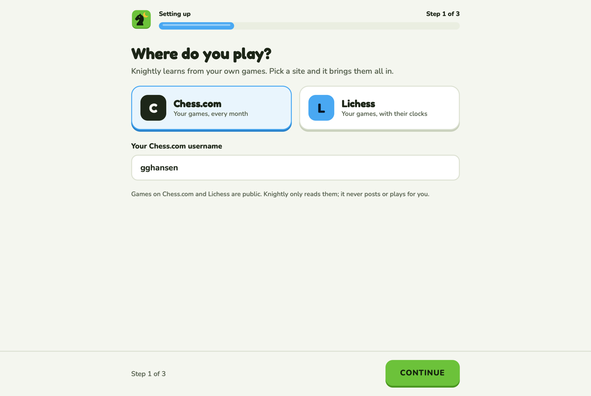
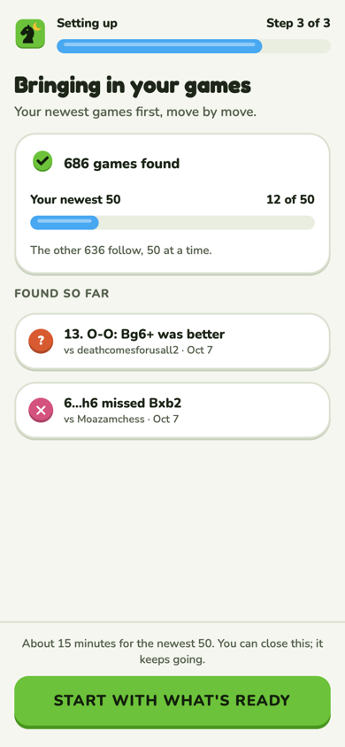
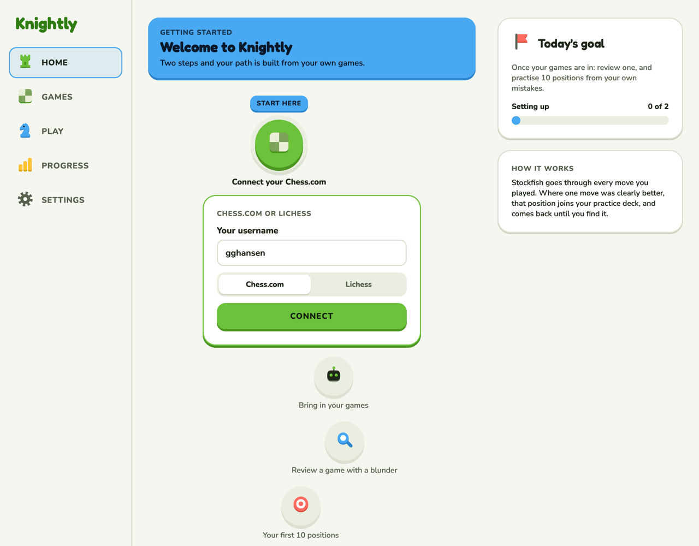
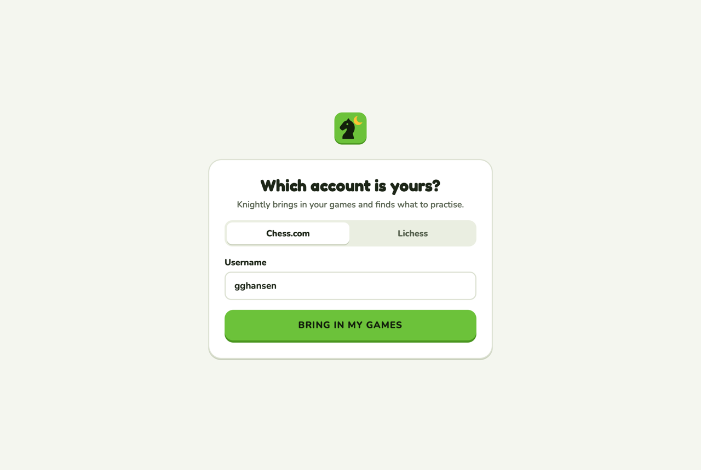

# Onboarding

A new account, from no games to its first lesson.

**Code:** `web/src/pages/welcome.tsx` (`/welcome`); AppShell sends any account with no
Chess.com or Lichess account here. **Built** as option A
([#58](https://github.com/hunterrhansen/knightly/pull/58); backend
[#57](https://github.com/hunterrhansen/knightly/pull/57)). Rules in design.md › Screens ›
Welcome.

| A: guided steps (chosen) | A on a phone |
| --- | --- |
|  |  |

## A: guided steps

Full screen like a lesson, no navigation, the mark and a "Setting up" bar on top. Four steps
(the canvas page's `step` states):

1. **Pick:** where do you play? Chess.com or Lichess, and the username.
2. **Found:** "Is this you?" with the account's rating, rated games and since when.
3. **Importing:** "Bringing in your games": games found, a bar for the newest 50, and findings
   as they turn up. "Start with what's ready" appears once the first game is analysed.
4. **Ready:** "Your first lesson is ready", the real counts, a gold moment.

What the backend does: adding an account queues an update; the worker imports the whole
history, analyses the newest 50 first (about 15 minutes on the server's 2 cores), then the rest
50 at a time in the background.

## Options not chosen

| B: Home is the setup | C: one card |
| --- | --- |
|  |  |

- **B:** no separate screens; the path's first nodes are "Connect your Chess.com" and "Bringing
  in your games". Least new UI, but the first impression is a page of locked nodes.
- **C:** a single card that asks, then lists games as they're analysed. Fastest to build, less
  to celebrate.

## Decisions (Oct 8)

1. Keep "Is this you?" (Chess.com sign-in isn't approved yet, so confirm instead of trusting a
   typed username).
2. Lichess by username only. Its puzzle history needs Lichess sign-in, later.
3. "Start with what's ready" after the first analysed game.
4. No email when the import is done, for now.
