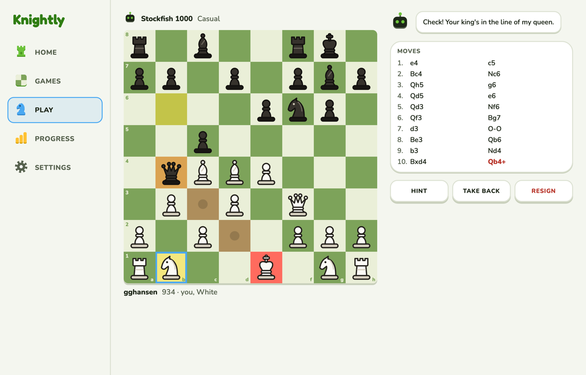
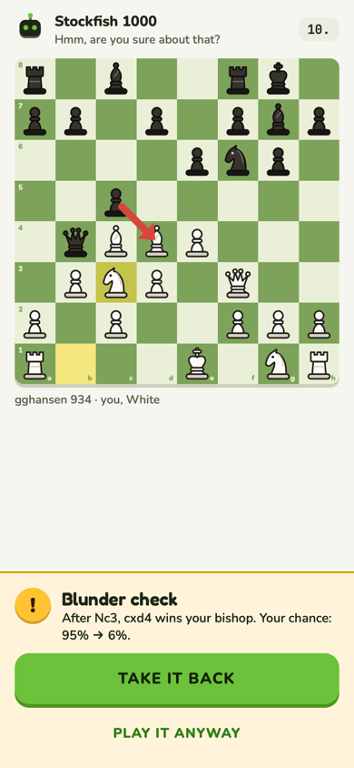
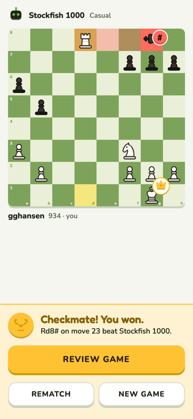

# Play

Play the bot, with Blunder check to catch the move that loses.

**Code:** `web/src/pages/play.tsx` (`PlayBoard`, `BotSays`, `BlunderWarning`, `MateCard`).
**Built.** Rules in design.md › Board (check, checkmate) and › Screens › Play.

| Phone: Blunder check | Phone: won by checkmate |
| --- | --- |
|  |  |

The canvas page has four states (setup, playing, blunder check, over won / lost); the picture
is its default.

## What's on it

- **Setup:** ten strengths (250 to full Stockfish), White / Random / Black, Blunder check
  switch (on by default).
- **Playing:** the board, the bot's avatar and speech bubble ("Thinking…" while it thinks),
  Hint (two steps, as in Practice), Take back, Resign. Saved as unrated and analysed; Review
  game afterwards.
- **Blunder check:** once per game the bot stops you before a move that loses 20+ points of
  winning chance. It names what the reply wins ("wins your bishop") or that it mates, shows the
  reply as a red arrow, and offers Take it back or Play it anyway. It's the Home path step
  "Play the bot with blunder check on".

## Check and checkmate

- **Check shows the attack** (chosen over a "Check!" bubble and a quieter ring, because the app
  is about learning to spot these): the king's square solid red, the path from the checking
  piece tinted. A knight check tints just the knight's square.
- **Checkmate, "the king falls"** (option A of three): check's red square and path, the king
  tips onto its side, a # badge lands on it, the winner's king gets a crown, with the checkmate
  sound. Plays once as the mate lands; a finished game shows the last frame. Everywhere a mate
  shows: Play, All moves, the lesson, Puzzles.
- **Result in Play:** a gold card and confetti on a win, a calm "Checkmated" card on a loss,
  then Review game / Rematch / New game. On a phone the result is a gold band along the bottom.
