# Practice

The Expo client's first deck fetch uses the shared [Knight hop loader](loading.md)
inside the lesson, retaining exit and footer actions. Advancing an existing
position retains its stable board and existing pending state.

Today's positions from your own games: find the move you missed. A lesson, full screen, no
navigation. Puzzles (`/puzzles`) use the same screen and rules.

**Code:** `web/src/pages/practice.tsx`, `pages/puzzles.tsx`, `components/lesson-bar.tsx`,
`components/find-bar.tsx`, `lib/find-move.ts`; scheduling in `deck.py`. **Built**
([#32](https://github.com/hunterrhansen/knightly/pull/32), Easy in
[#40](https://github.com/hunterrhansen/knightly/pull/40), FSRS tuning in
[#41](https://github.com/hunterrhansen/knightly/pull/41)). Rules in design.md › Lessons.

| Try again and Hint | Every bar and its grade |
| --- | --- |
|  |  |

| Done for today | Phone: right answer | Phone: one more go |
| --- | --- | --- |
|  |  |  |

## Layout

- **Top:** ✕ (back Home) and the progress bar, "3 of 10".
- **Prompt:** pills (New or One more go, the game it came from, the move's badge), then the
  heading "You played Qxc8 here. Find a better move." and a line with the side to move and
  your winning chance then.
- **Board**, as big as the space left. Tap or drag a piece; legal moves show as dots and rings.
- **Bar along the bottom:** Skip and a line of help before you answer; the verdict after.
- **Done for today:** a check medal, "10 positions reviewed. 7 right, 3 back tomorrow", a row
  of marks with the misses named, and tiles for Mastered, Learning, Not seen yet. See your deck
  and Back home.

## Expo completion parity — October 10, 2026

`mobile/src/screens/practice-complete.tsx` ports the web's phone completion page:
a 96px gold check medal on its solid ledge, centered title and first-attempt
summary, a “Today, one by one” card with accessible result bars and the original
game moves to revisit, and three equal-width Mastered / Learning / Not seen yet
tiles. The FSRS explanation uses the current web wording. Filled green Back home
and outlined See your deck actions occupy the pinned bottom slots. Completion removes the
active lesson's exit/progress header. Theme colors come from the shared tokens.

Completion scrolls within the safe area when result text, system text size or a
short viewport needs more room. The solving screen keeps its bounded board and
fixed footer. Connected results and deck counts come from the existing API;
redo attempts do not overwrite first-attempt marks. Empty decks, loading and
request failures retain their existing separate states.

Sample practice shares the completion styling and records its actual local
outcomes. It labels the page “Sample complete,” omits account deck totals and
offers Practice again. Recovering after a wrong sample attempt stays marked as
helped, matching connected practice; hints are also counted as help. Sample moves to revisit are named by position
because they have no source game.

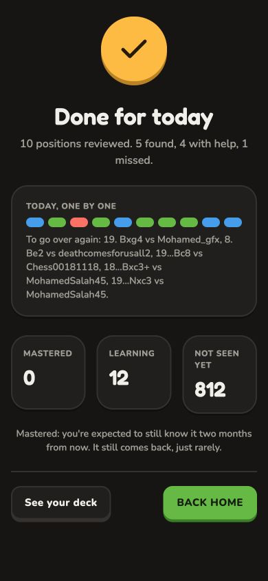

This capture uses a temporary local fixture matching the supplied web phone
reference (10 reviewed, 5 found, 4 with help, 1 missed); the fixture was removed.
Browser checks verified See your deck → Progress, Back home → Home, no horizontal
overflow at 320×568, and all three sample positions through Show me, completion
and Practice again. Progress currently remains a mobile placeholder, so the deck
link preserves the web destination without claiming deck-view parity.
Native interaction and accessibility acceptance remain pending: the Mac was
locked during this check. This picture is React Native Web, not an iOS capture.
Mobile lint, typecheck, token consistency, all 58 tests, and iOS/web exports
passed. Exports confirm compilation; they do not replace native interaction checks.

### Completion motion parity

Completion now copies the web's `bounce-in`, `rise` and confetti keyframes and
`--ease-out` curve (0.22, 1, 0.36, 1). The medal bounces through scales
0.3 → 1.12 → 0.92 → 1.04 → 1 across 900ms. A seeded 36-piece burst uses the
same theme colors, shapes, spin, upward/falling paths and 1–1.6s durations as
`web/src/components/confetti.tsx`. It fires once per completion mount.

The heading rises 10px at 360ms, the results card at 405ms, and stat tiles at
450 / 530 / 610ms; each rise takes 300ms. Counts use the web's 400ms cubic
ease-out and start with their tile entrance so the counting remains visible.
Native counts update text through Reanimated on the UI thread; the browser uses
the web's requestAnimationFrame counter. Accessibility exposes final counts.
Reduce Motion skips all entrances and confetti and shows final numbers immediately.
Actions stay available throughout; only transforms and opacity animate layout.

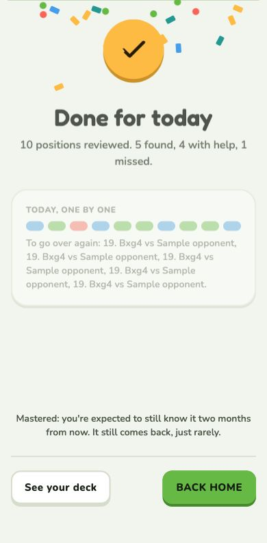

The capture crops out a temporary fixture's Replay control. Browser inspection
confirmed the above computed durations/delays, 36 particles, final count values,
and zero animations with emulated Reduce Motion. The fixture was removed.
Native animation feel and count rendering still need an unlocked simulator or
device; the Mac remained locked during verification. This pass adds visual motion;
the web completion fanfare is not included.
Final mobile lint, typecheck, token consistency, 58 tests and iOS/web exports
passed after the motion changes.

### iOS simulator acceptance — October 10, 2026

Verified in Expo Go on the iPhone 18 Pro simulator, iOS 27: the real three-position
sample reaches completion, and a temporary local fixture exercises the full
10-result screen with deck counts 0 / 12 / 812 in light and dark themes. No account
results were written. The fixture and root-layout override were removed afterward.
The real sample's Practice again resets to 0 of 3; Back home returns to Home.

Native inspection caught two issues: percentage-height stat cards expanded within
the ScrollView, and TextInput counters reset after unrelated React renders. Cards
now stretch through their wrapper using flex, preserving equal heights and natural
text sizing. Counters keep their settled fallback after the UI-thread animation
finishes, with one JS update instead of a JS update on every frame.

Observed the medal bounce, confetti burst and staggered card entrances. A temporary
4-second counter diagnostic visibly progressed through intermediate values
(including 4 / 236), then settled at 12 / 812; the production 400ms duration was
restored. Hiding fixture controls after settlement preserves the final numbers.
All content and both actions fit the simulator's full-height viewport.

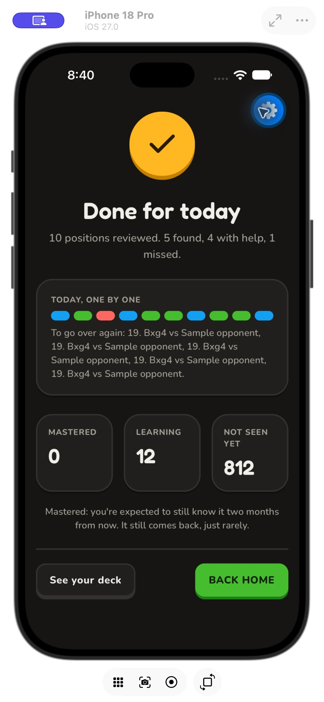

System Reduce Motion, VoiceOver, physical-device feel and release-build frame
performance remain acceptance checks. Expo Go's floating gear is development UI.
The earlier browser checks cover emulated Reduce Motion; this native check does
not claim authenticated completion or deck-view parity.
Mobile lint, typecheck and all 64 tests passed after these native fixes.

## Forgiving practice (decided Oct 7, replaces "one answer a day")

Why: learning beats engagement. Only 1 of the first 10 Practice answers was right, and each
miss was a dead end.

- **Try again:** a wrong move slides back: "Not quite. Try again, or use a hint."
- **Hint,** two steps as on Lichess: Hint lights up the piece to move, then the button becomes
  Show the move and draws the arrow. When the position has a tactic, a first step names it
  ("Look for a fork…"). Live two seconds after the position appears (Chess.com's top complaint
  is accidental taps). Show me stays separate and gives the answer.
- **One more go:** positions you didn't get on the first try come back once at the end of the
  session. The session ends when each is solved; that go doesn't change the grade.

## Grades

FSRS, the scheduler Anki uses by default (chosen over SM-2), with default settings until there
are a few hundred reviews; `knightly fsrs-optimize` tunes it after 512. The app presses Anki's
buttons for you, from your **first try only**:

| First try | Grade |
| --- | --- |
| The engine's move within 10 s, no hint | Easy |
| Best, or within ~2 points of win chance | Good |
| Within ~5 points ("Good move! Best was …") | Hard |
| Right on a retry, after a hint, or shown the move | Again |

Any checkmate counts as best. The same rules apply to the review lesson's find steps and to
Puzzles (nothing is sent to Lichess).

The Done for today picture still says "mastered after 4 right in a row"; that line predates
FSRS, so take the wording from the app.

## Expo lesson shell — October 9, 2026

Sample and connected practice now share `mobile/src/components/lesson-screen.tsx`.
The active lesson is a full-height flex layout with no ScrollView: × exits to Home,
the header contains session progress, the prompt sits above the board, and feedback
and actions stay in a full-width band above the bottom safe area. The board fits
both available width and remaining height, including its 4px ledge. The prompt
and Hint provide guidance without a header question mark. Appearance
controls remain in Settings.

Hint (with the brand bulb), Show me and Flip live in the idle/retry band. Correct
answers replace them with a green verdict and Continue; showing the move uses the
red verdict and Continue. Hints unlock after two seconds. The connected flow keeps
the existing server answer/hint calls, first-attempt grading and end-of-session
redo queue. Sample practice is explicitly local and never updates the real deck.
Completion uses a concise summary and result marks instead of a scrolling list.

| iPhone: before answering | iPhone: larger text |
| --- | --- |
|  |  |

The floating blue gear is Expo Go's development overlay, covering part of the header;
it is not part of the lesson design. Native captures were checked at normal and
accessibility-large text. Text in the bounded lesson chrome scales up to its local
limit; it does not disable system text scaling globally.

The shared flow was exercised through React Native Web at 390×844 and 320×568:
wrong move and reset, recovery with the correct move, Continue, Show me, completion,
and × exit to Home. The short-screen document height stayed at 568px, with actions
inside the viewport. The same sample flow passed in the iPhone 18 Pro simulator:
wrong move and automatic reset, correct recovery, Continue to the next position,
Show me, completion, and × exit back to Home. Connected grading and network failure
recovery were not replayed against an account.
After integrating the latest main, lint, typecheck, token consistency, all 25
existing tests, Expo Doctor (21/21), and iOS/web exports passed.

### Motion follow-up

The question mark is removed; the prompt and Hint provide lesson guidance.
Practice keeps the default iOS push/pop transition and immediate feedback/progress
updates. The experimental fade, verdict entrance and progress-fill animations
were reverted after device review. Refine motion in a later design pass.

### References checked

- The web `LessonScreen`, `LessonBoard`, `LessonBar` and `FindBar`, plus the phone
  screenshots above, are the direct layout reference and brand source.
- [Duolingo's lesson examples](https://blog.duolingo.com/duolingo-101-how-to-learn-a-language-on-duolingo/)
  provide the focused exercise and answer-control structure. Knightly retains its
  own task, typography, icons and feedback rules.
- [Chess.com's Daily Puzzle flow](https://support.chess.com/en/articles/8708990-how-does-the-daily-puzzle-work)
  provides a board-centered solving and hint reference. Knightly's no-scroll,
  bottom-band layout follows its existing practice specification; it does not add
  Chess.com's hearts, subscriptions or puzzle economy.

### Practice parity follow-up — October 9, 2026

Connected and sample lessons now offer Queen, Rook, Bishop and Knight promotion
choices in the bottom band. Selecting a piece does not submit an answer; the
confirmation button sends the exact promotion UCI. The third sample position
requires a knight: a queen stalemates. Server grading evaluates the chosen piece.

Hints follow the web ladder: tactic idea (when recognized), highlighted piece,
then move arrow. The prompt includes the move classification and previous move;
feedback retains the server explanation and next review date. Completion separates
independent answers, answers with help, and misses.

Connected practice stores hints and unfinished retries on the device, scoped to
the server, signed-in user and UTC day. In-flight cards are saved before answering;
on reopening, server results recover misses/helped cards after a lost response.
Completed retries are removed, and server results discard stale cards. The server
continues to own first-answer grades and scheduling; retries use `redo: true`.
Storage failure leaves the current session usable but cannot guarantee recovery.

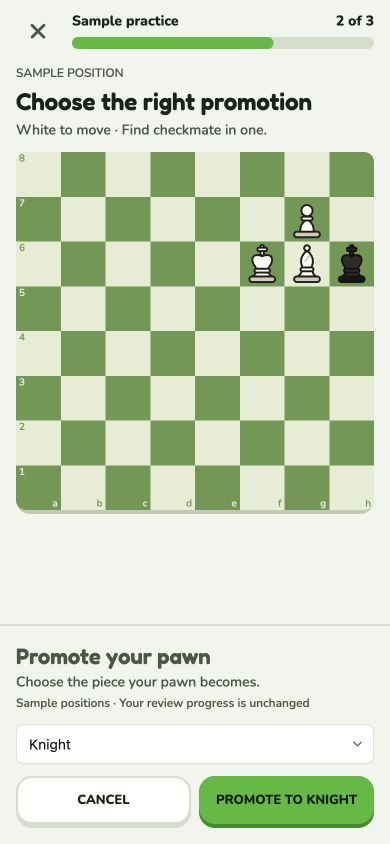

Browser checks used sample positions and stubbed connected API responses: hint
ladder, wrong/correct recovery, exact knight payload, Show me, unchanged redo
schedule, request failure/retry, sign-in rejection and repeated taps. At 320×568,
actions stayed inside the viewport. The native follow-up check is recorded below; the earlier iPhone captures show
the previous lesson shell.

Follow-up checks: mobile lint, typecheck, token consistency, all 36 tests,
Expo Doctor (21/21), and iOS/web exports pass. The backend underpromotion
regression passes. The full backend run has 51 passing tests and 4 skips;
95 database-dependent tests could not start because local Postgres is unavailable.
No hosted database was used for tests. The installed iPhone preview does not include this follow-up.

### Native follow-up verification — October 9, 2026

On iPhone 18 Pro / iOS 27 in Expo Go SDK 57, the three-position sample passed:
wrong move and automatic return, tactic/piece/move hint ladder, correct recovery,
Show me, Continue, required knight promotion, session completion and Back home.
Home now consistently labels the sample as three positions.

The iOS promotion control uses a compact native segmented picker: Queen, Rook,
Bishop and Knight are visible together. Choosing Knight updates the confirmation
button without moving the pawn; confirmation produces the knight and checkmate.
Android and web use the universal dropdown. During native automation the popup
menu repeatedly surfaced an obstructing keyboard; the inline segmented control
avoids that popup and preserves board space better than a wheel picker.

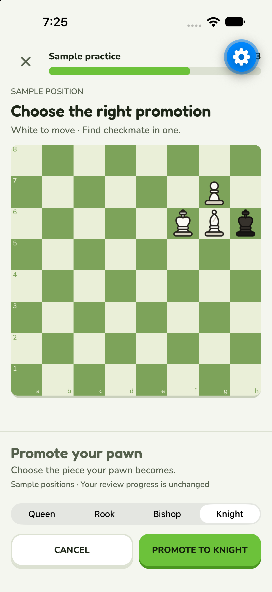

The screenshot shows the full board and reachable Cancel/confirmation controls.
Expo Go's blue gear is a development overlay. Connected account grading and
on-device retry persistence were not replayed; those have browser/API/helper
coverage. Physical-device VoiceOver, large-text and Reduce Motion checks for the
new promotion control, and Android interaction testing, remain release checks.

After the final native selector and Home-copy changes, lint, typecheck, all 36
mobile tests, token consistency and iOS/Android/web exports passed. Android
export is compilation evidence; Android interaction acceptance remains pending.

## Mobile played-move context — October 9, 2026

Connected practice uses the concise heading “Find a better move.” The detail names
the original move, side to move, and winning chance; the classification text remains
in the metadata row. A blue arrow traces the original game's UCI move on the
pre-move position, with its classification symbol in the destination square's
upper-right corner. The arrow and corner badge follow Flip. They hide while a
piece is selected, a request or promotion is pending, the wrong move is resetting,
an answer is shown, or the piece/move hint is active. This keeps the original
game's classification from appearing to grade the new attempt. Unknown
classifications omit the badge. No engine continuation or answer is revealed.

The lesson board uses the full safe-area width (390px board and 48.75px squares
at a 390px viewport). Header, prompt, completion text and bottom controls retain
16px insets. On compact screens or larger text, remaining height still limits the
board so actions remain reachable; the shared desktop width cap is 560px.

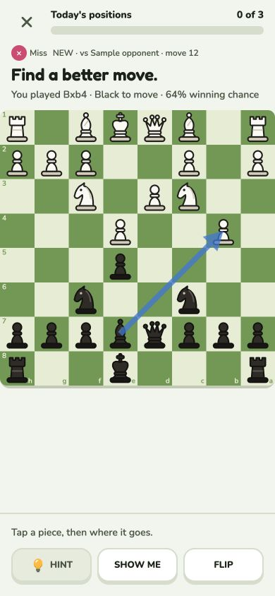

Verified with a local connected-screen fixture: flipped context, selection hides
the badge, failed answer request recovers, and actions fit a 320×568 viewport.
The fixture was removed afterward. Native screenshot verification is pending
because the Mac was locked during this check; this picture is React Native Web.

## Immediate move response — October 9, 2026

A legal attempt now moves the piece before local storage, authentication, API or
engine waits. While the authoritative answer is pending, the footer says
“Checking move…” and repeat submissions are disabled. A failed request restores
the original position and last-move context, displays the error, and permits retry;
no local success is claimed. The verdict still waits for the server and a local settlement attempt (storage remains best effort). First-answer elapsed time is captured at the final tap, excluding
network and persistence waits from the Easy threshold.

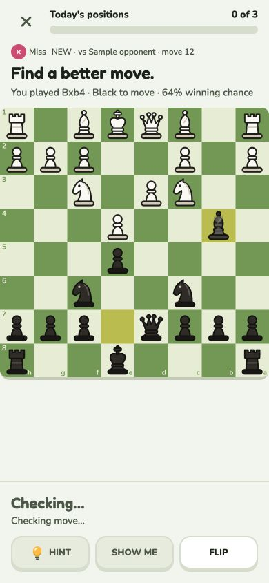

Browser verification used a five-second failed-save fixture: the bishop appeared
on b4 while “Checking move…” was visible, then returned to e7 with an actionable
error and enabled controls. The temporary fixture was removed afterward. Native
physical-device response time remains unmeasured.

## Prepared move feedback — October 9, 2026

The worker prepares per-position grades ahead of practice in two-card batches.
The card carries a versioned map tied to its FEN, reference evaluation, grading
policy and Stockfish binary. A prepared legal attempt moves and flashes right or
wrong immediately, with “Saving your attempt…” in the footer. Continue remains
unavailable until the authoritative answer succeeds and local settlement is
attempted. Storage retains its existing best-effort behavior. A failed request
clears the provisional verdict, restores the position and enables retry.

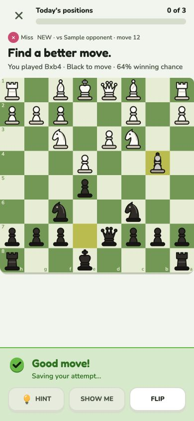

Preparation is optional: shallow or time-limited searches omit uncertain moves;
missing or stale entries use live server grading. An initially cold card polls
for prepared feedback every five seconds for up to one minute. Engine failures
return a retryable error without scheduling a wrong answer. The cache inherits
the existing move-row user isolation. Searches occur outside transactions with
one single-threaded engine and a 30-second budget per card.

The browser fixture verified instant prepared feedback without early Continue,
and rollback after a five-second failed save. It was removed after verification.
All 165 backend tests and 42 mobile tests passed, including cache invalidation,
promotion, partial-map fallback, user isolation and first-answer scheduling.
Lint, typecheck, token consistency and iOS/web exports also passed.
A local starting-position benchmark prepared all 20 moves in 1,989ms; a live
alternative grade took 249ms. These measurements exclude network and device
latency. Native interaction verification remains pending while the Mac is locked.

## Subtle practice rewards — October 9, 2026

A correct attempt uses Knightly's original two-note mallet motif, lowered to
65% of its previous amplitude, and a system success haptic on native devices.
The result cues land with the board feedback; selection keeps its gentle tick.
The bottom status enters with a 12px upward translation and opacity over 180ms,
using a strong ease-out on the UI thread. It animates its content rather than
height, keeping actions available immediately. Reduce Motion skips the entrance.
Idle instructions and hints do not animate.

A stable attempt/verdict identity is shared by the prepared preview and saved
response. An unchanged verdict does not replay sound, haptics, or status entrance
when the server responds. A fresh attempt or corrected verdict gets a new cue.
Failure still clears provisional feedback and restores the board. Checkmate
keeps its existing victory sound rather than layering another success chord.
Bundled audio works offline and respects the audio session's silent-mode setting;
background cues and web haptics remain suppressed. No new dependency was added.

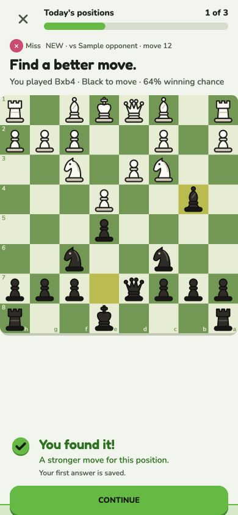

A local delayed-save fixture verified prepared feedback without Continue, followed
by saved success and Continue at a 390×844 viewport. The fixture was removed.
The identity regression covers preview/save deduplication, retries and corrected
verdicts. Physical-device sound volume, haptic strength, Reduce Motion and smoothness
remain acceptance checks: the Mac was locked during native verification.
The reference is Duolingo's correct-answer celebration approach described in
[Building character](https://blog.duolingo.com/building-character/); sound assets
remain original Knightly synthesis.

The sample-practice footer uses the same result entrance. A no-server Expo Go
session can preview the rewards without Clerk sign-in or changes to real progress.
Browser verification confirmed the sample route opens without authentication.

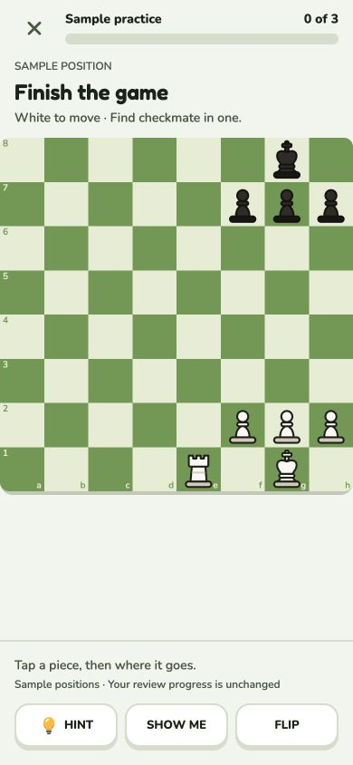

## Lower board and optional explanations — October 9, 2026

The Expo board has square outer corners. Sample and connected practice anchor
the board toward the bottom of the lesson area, with the short side-to-move prompt
directly above it. At a 390×844 browser viewport the board is 390px wide, beginning
at y=274 (32.5% of the viewport). The practice footer reserves 160px so normal idle
and result transitions keep that anchor stable. This minimum-height reservation was replaced by the fixed geometry described
in “Stable practice layout” below; message length no longer resizes the board.
The supplied Chess.com and Lichess phone screenshots are the placement reference.

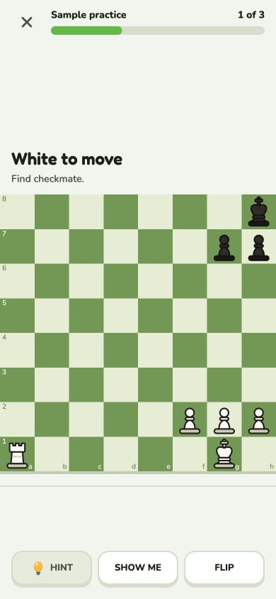

Idle footers contain controls without repeated tap instructions. Above the board,
connected practice says the side to move and “Improve on [original move]”; sample
practice says “Find checkmate.” Result status stays visible, but explanations,
game metadata, winning chance and review timing are available in a scrollable
“Why this move?” dialog. Continue remains a separate action. The existing dialog
primitive provides a close action and focus restoration. Hints, saving states,
errors and promotion instructions remain visible without opening the dialog.

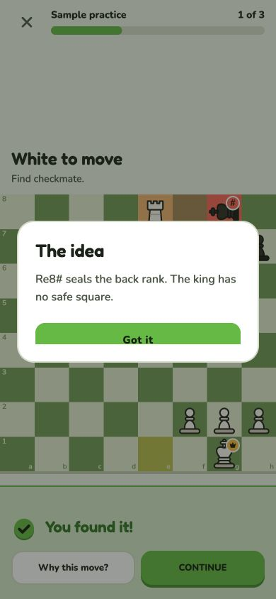

Browser verification covered a solved sample, opening and closing its explanation,
Continue, 390×844 placement, and reachable controls with a square board at 320×568.
Native dialog/large-text behavior remains a device acceptance check. The running
Expo Go sample preview includes this layout through Metro; hosted account access
and the backend preparation deployment remain separate work.

## Board boundary and next-position motion — October 9, 2026

The bottom controls have no top border. The lesson's bottom spacer is removed,
and practice disables the board's 4px ledge, so the last rank meets the footer
directly, with no strip between them.
The 160px practice footer reservation remains; at 390×844 the 390px board now
starts at y=294 and ends at the controls area.

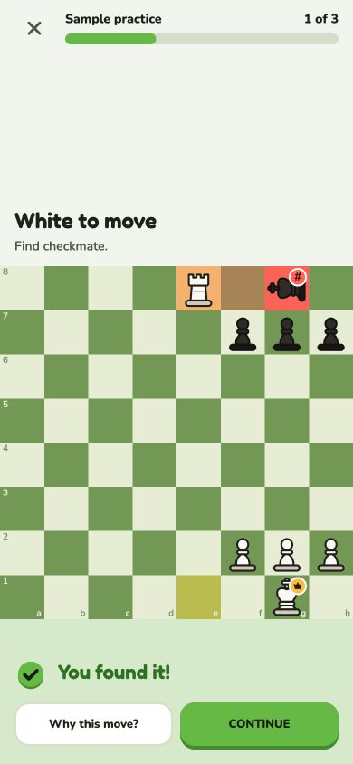

Continue rearranges the pieces over 200ms on the UI thread, using the web
board’s CSS ease curve (0.25, 0.1, 0.25, 1).
Same-color, same-type pieces keep their identity: unchanged squares are matched
first, then remaining pieces by the movement preferences in react-chessboard
5.12.1 (same-file pawns, knight moves, diagonals for bishops, straight lines for
rooks). If no movement matches, use board order. Each identity is used once.
Added pieces appear and removed pieces disappear at the end of the slide, without
fades or landing bounce; position transitions are silent. Reduce Motion snaps to the
new position. Ordinary moves, captures, promotions and rewards retain their
existing behavior. Captured pieces discard old transition origins before fading.

Sample practice retains the Board instance when the exercise changes. Connected
practice keeps the solved board visible while fetching, disables Continue with
“Next…”, and passes the solved FEN and orientation into the next keyed card.
Grading, hint and retry state still reset per card. Initial mount origins allow
the next card's pieces to slide even though its lesson state is new.

Browser verification solved a sample and advanced to the next one; the board meets the
footer directly after a correct answer. Unit checks cover identity matching,
new-piece IDs, web movement preferences, forced silent seeds and
capture-after-rearrangement and removed-piece orientation regressions.
Native timing, opposite-side transitions and Reduce Motion remain phone acceptance
checks. The live Expo Go sample preview includes these changes.

Result sound and haptic acknowledge a newly known verdict immediately, independent
of the 200ms piece animation. A mating move plays its single victory sound at that
same immediate point. Prepared and server-confirmed copies of the same verdict
retain one reward identity, so saving does not replay feedback. Ordinary replay
sounds retain their animation timing; silent mode and haptic settings still apply.

Practice invokes verdict haptics directly in the verdict handler, before the board
render; its Board effect is disabled for verdicts while pickup ticks remain.
Correct answers use one rigid impact instead of the system success notification
pattern. Server-only verdicts acknowledge before local recovery settlement;
Continue still waits for settlement. Prepared and confirmed copies share the same
haptic identity. Physical onset and crispness require a phone acceptance check.

## On-board promotion — October 10, 2026

Promotion replaces the footer picker with a vertical stack on the destination
file: queen, knight, rook, bishop, then ×. The queen sits at the promotion edge;
the stack grows inward, including when the board faces Black. Targets are at
least 44px on small boards; on boards shorter than the stack, it scrolls within
the board (opening at the promotion edge). Web keyboard focus stays within the
choices and returns to the prior board target on dismiss. It uses Knightly’s pieces in the moving pawn’s color.
Only legal choices are included. A piece tap commits the chosen promotion; ×,
an outside board tap, Escape on web, or Android Back cancels without grading.
The pending pawn is held at the destination until choose/cancel. Other board
interaction and footer controls are disabled during the choice; footer height
and board position remain stable. Native accessibility escape cancels too.

The reference was observed directly on
[Chess.com’s analysis board](https://www.chess.com/analysis?fen=7k%2FP7%2F8%2F8%2F8%2F8%2F8%2F4K3%20w%20-%20-%200%201).
Its [promotion help article](https://support.chess.com/en/articles/8588160-how-can-i-turn-my-pawn-into-a-queen)
explains the four choices; the stack placement/order came from the live board.
This is a custom board overlay because a native form Picker/Menu does not place
four chess-piece targets along a board file.

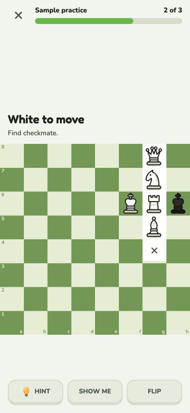

Browser verification covers cancellation, a 390×844 board, a flipped board at
320×568, and one-tap knight underpromotion. Unit tests cover both pawn colors,
orientation, legal choice filtering, and edge-file geometry. Native VoiceOver,
TalkBack, Android Back, and drag cancellation remain physical-device checks.

## Stable practice layout — October 10, 2026

Practice uses a fixed 160px footer, with extra space based only on system text
scale and bottom safe area. A pinned 64px action band never moves when hints,
saving, retries, errors, or results appear. Long status messages scroll in the
remaining space; only the status content animates, not the action band.
The prompt occupies a fixed 54px space (scaled for system text), with scrolling
for long wording. Progress/title stay on one row. Explanations and promotion
remain overlays. Board bounds are retained across keyed connected-practice cards
so a new puzzle can render at the measured size immediately, including its pieces.
A failed next-puzzle fetch keeps the solved board visible and shows a retry
message; Continue retries fetching without grading the answer again. Rotation, window
resizing, and changing system text size legitimately recalculate geometry.

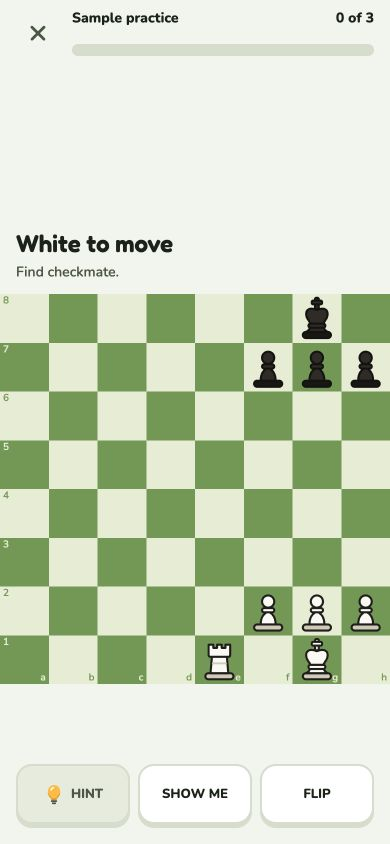

A temporary browser regression fixture reproduced a disappearing board with a
long error before this change. Afterward, 15 measurements across five states
(idle, saving, long hint, long error/prompt, success) at 320×460, 320×568 and
390×844 had identical board bounds and action-band vertical bounds, including
keyed board remounts. The fixture was removed. The real sample flow also verified
success, explanation open/close, next puzzle and promotion open/cancel with the
390px board anchored at y=294. Native Dynamic Type, safe areas and VoiceOver
remain physical-device acceptance checks.

The earlier two-button result row below was replaced by the approved reference
layout described in the next section.

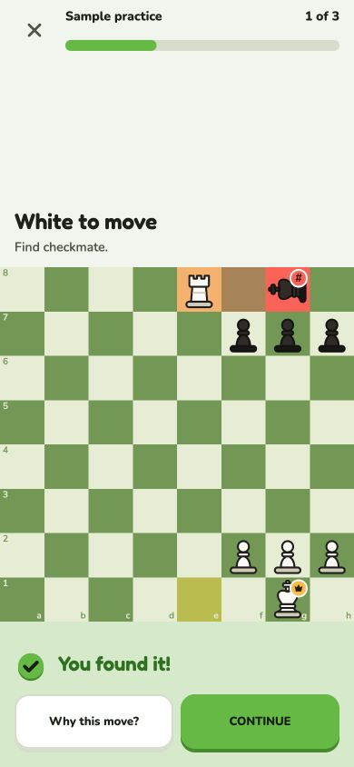

## Shared bottom actions — October 10, 2026

The later approved reference layout below replaces the practice result slots;
the shared footer geometry and completion controls described here are retained.

The bottom actions now keep the same size and location from solving through
completion. `BottomActions` owns two equal-width slots, safe-area spacing,
font-scale growth and the reserved feedback region. `LessonBar` supplies its
verdict content; completion keeps its results in a separate ScrollView above the
same footer. A missing secondary action leaves an empty left slot. Primary actions
remain on the right, even for loading, empty and retry screens.

Hint / Show me becomes Why this move? / Continue, then See your deck / Back home
(or Practice again / Back home for the sample). Flip moved beside the practice
header, with its promotion lock preserved. Default action-band height is 64px,
including the 4px ledge; margins are 16px and the slot gap is 8px. Shared buttons
and the explanation trigger allow system font scaling; the band grows with it.
Animations affect content above the controls, preserving immediate access.
The footer uses whitespace alone to separate actions from content; no divider.
The band grows using width-aware label wrapping, including hint icons and long
words, instead of assuming at most two lines. Geometry regression tests cover
320px phones at 2× and 2.8× text scale; system Dynamic Type remains unverified.

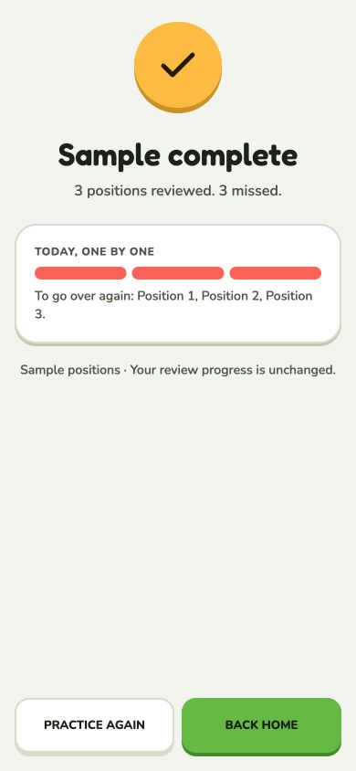

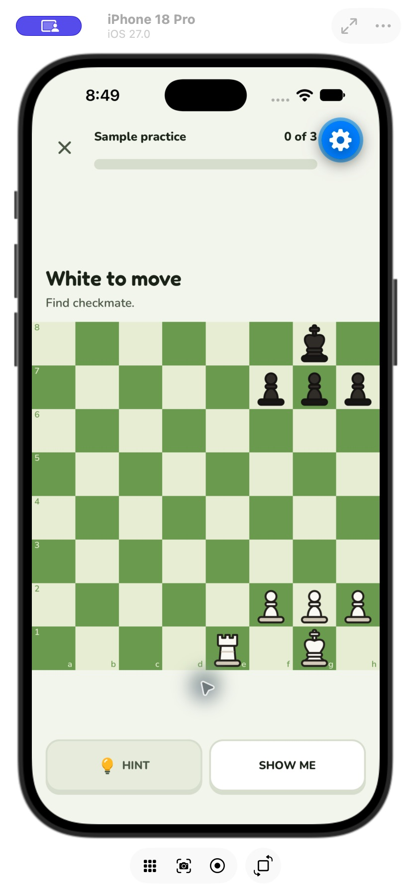
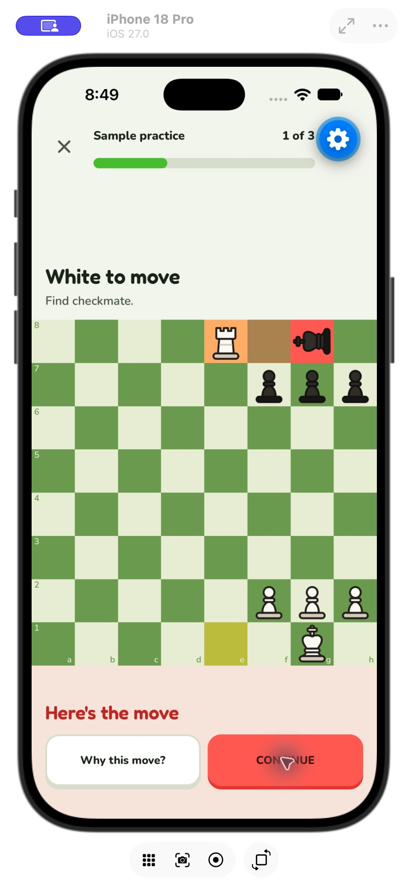
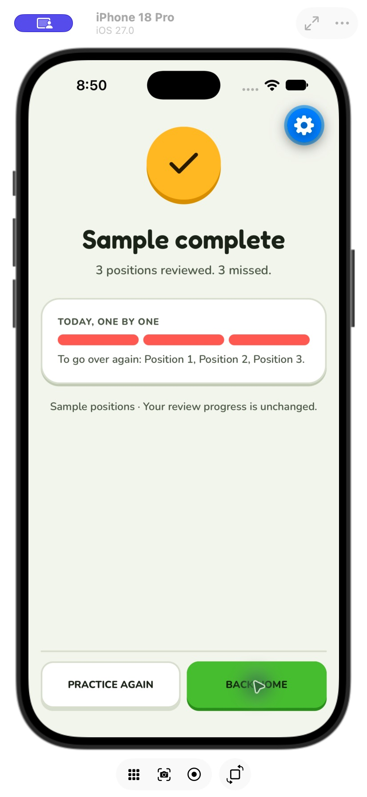

The iPhone 18 Pro simulator verified the real sample through Show me, Continue
and completion. Browser measurements at 320×568 found identical primary button
bounds in solving, verdict and completion: x=164, y=488, width=140, height=60
(the 64px base includes its ledge). A local full-results fixture verified the
same bounds with ten results and deck counts, then 175×60 at x=199, y=764 on a
390×844 viewport. Content scrolls above the footer; the fixture was removed.
System Dynamic Type, VoiceOver and physical-device ergonomics remain acceptance
checks. Connected grading is unchanged; authenticated interaction was not tested.
Browser interaction also verified header Flip changes board orientation and the
explanation dialog opens/closes without moving Continue. Mobile lint, typecheck,
token consistency, all 64 tests and iOS/web exports passed after the shared-footer
and large-text sizing changes. The five added geometry tests cover the default
64px band and label wrapping at larger font scales; at 320px and 2×/2.8× scale,
the shared band reserves 136px/230px respectively.

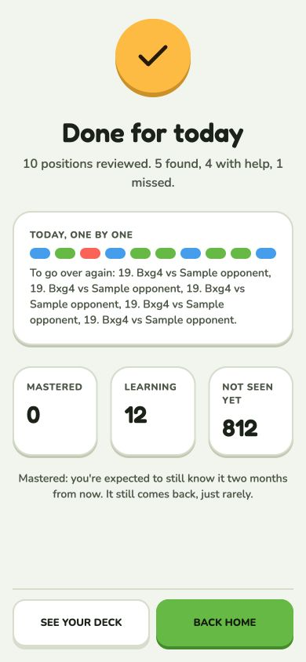

## Approved reference layout — October 10, 2026

The owner approved a practice layout following Chess.com's mobile puzzle
hierarchy and Duolingo's lesson feedback pattern. Sample and connected Expo
practice use a single header row: exit, green progress bar, count and Flip. The lesson
title remains in the progress accessibility label. The side-to-move prompt and
short task stay directly above the square board; game context remains available
after answering through the explanation dialog.

The full-width feedback band keeps a fixed 208px reservation and 64px action
row. After an answer, the underlined “Why this move?” trigger sits beneath the
verdict and Continue is the only button in the bottom row, spanning its width.
The feedback begins 16px below the board. Its scrollable content starts at the
top so wrapped verdicts and longer status messages cannot disappear above the
viewport. The reservation includes room for the title, a short status message,
the explanation target and the gap above the action row, in every answer state.
The trigger has a 44px minimum touch height; its dialog retains close and focus
restoration. The idle/retry Hint and Show me occupy the two action slots;
Flip remains the header utility added by the shared-footer change.
Sample independent answers name the solution (for example “Found it: Re8#”);
connected practice says “Found it!” so an accepted alternative move is not
mislabeled as the engine's preferred move. Helped and good-move verdicts retain
their existing wording. Server grading, hint timing, retries, promotion and
completion behavior are unchanged.

| Before answering | Correct answer |
| --- | --- |
| 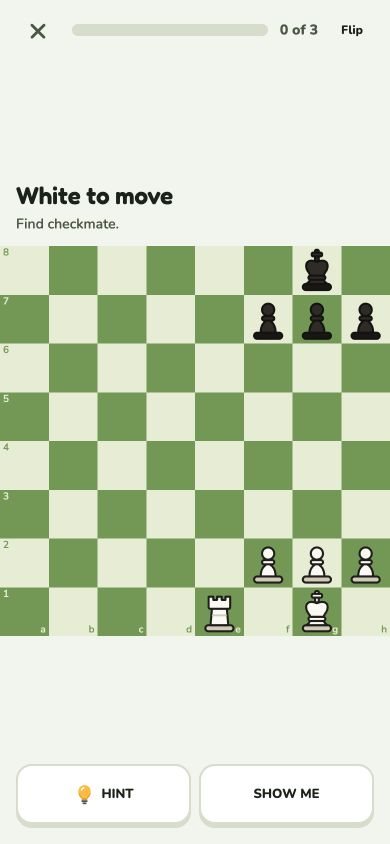 | 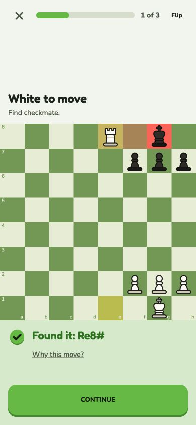 |

These are actual sample-practice screenshots from React Native Web at 390×844,
not generated mockups or native captures. Browser checks covered a wrong move
and reset, hint, helped answer, independent Re8# answer, explanation open/close
and focus restoration, Continue, and Show me at 320×568. The 390px board stays at
y=246 and action faces at y=764 across idle and answered states; Continue is 358px
wide with the usual 16px insets. At 320×568 the page fits without horizontal or
vertical overflow. The dark theme also keeps the verdict and explanation legible.
Native interaction verification is pending because computer-use access reported
the Mac locked. No connected account was used for these browser checks.
Mobile lint, typecheck, token consistency, all 64 tests, and iOS/web exports pass.
Exports confirm compilation, not native interaction or physical-device behavior.

The feedback-spacing correction was checked at 390×844, 320×568 and 320×460.
The verdict starts 16px below the board and the explanation remains fully inside
the feedback viewport. Explanation open/close and focus restoration still work.
Lint, typecheck and all 64 tests pass after the correction. Native confirmation
remains pending.
