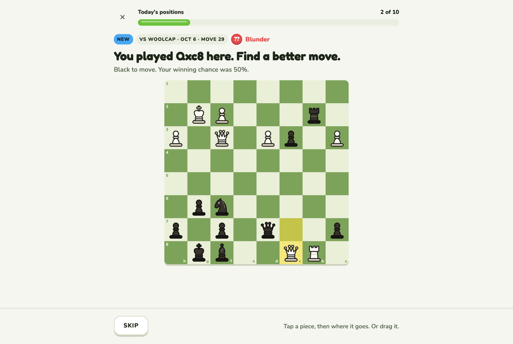
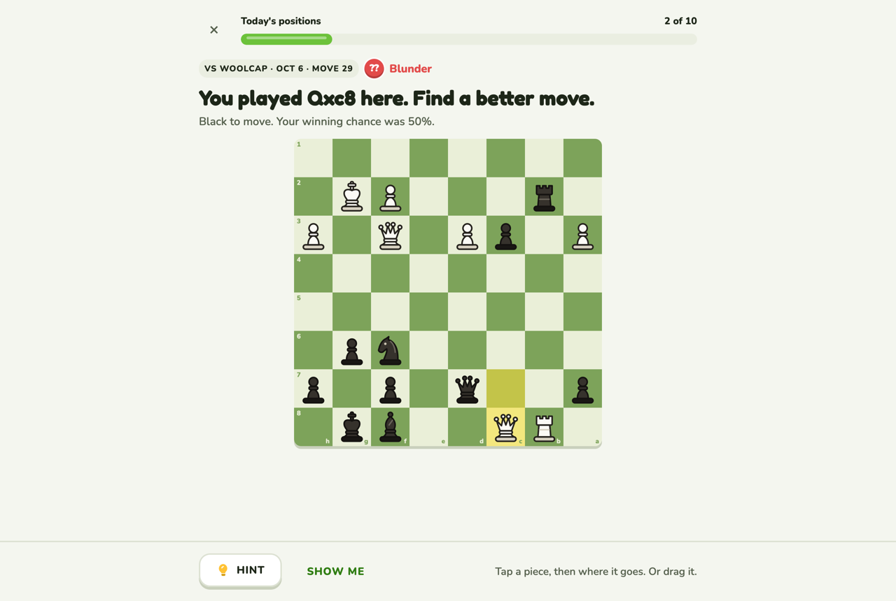
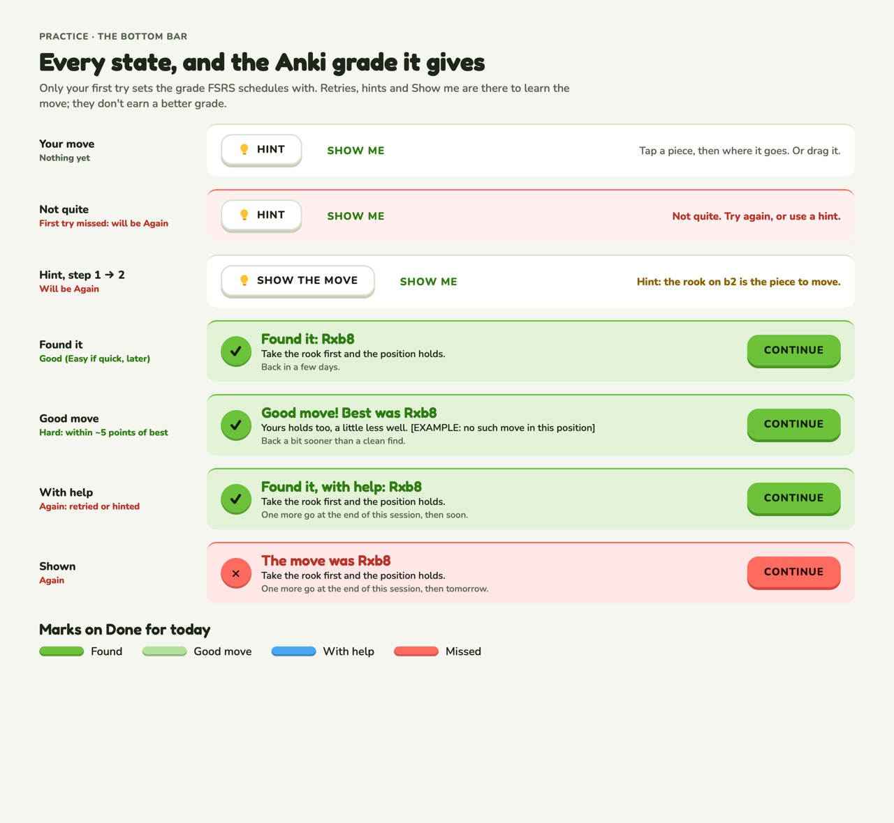
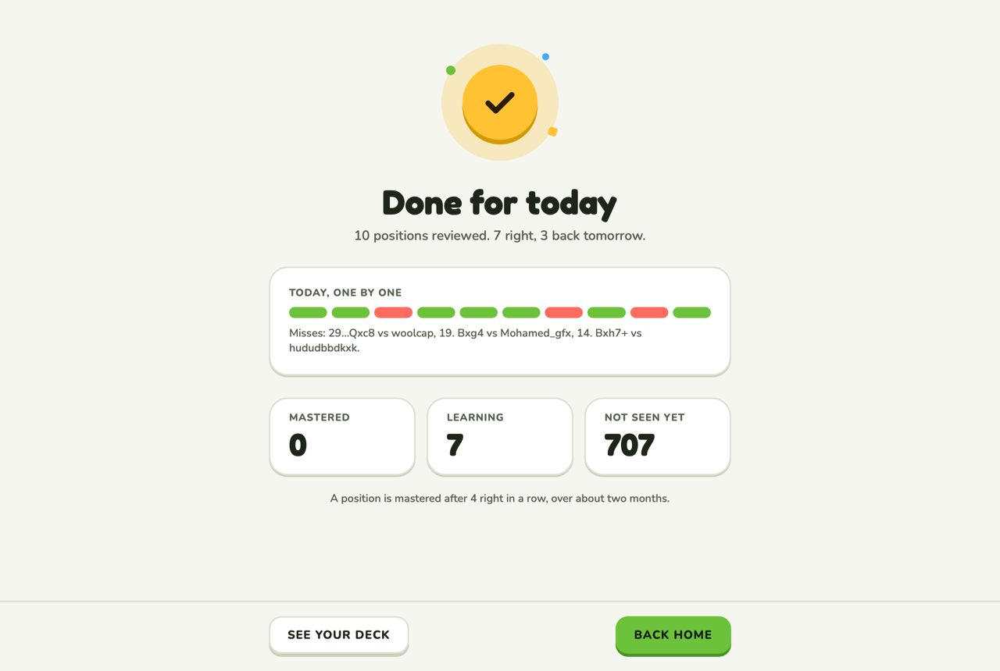
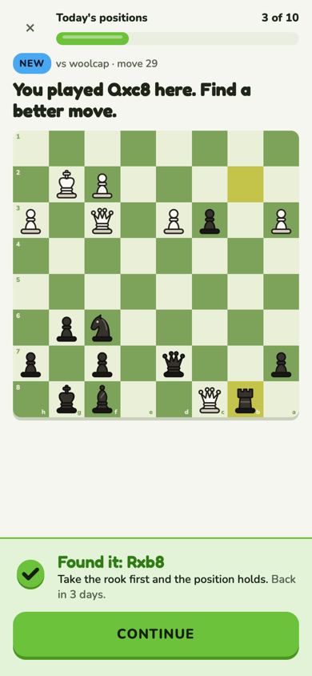
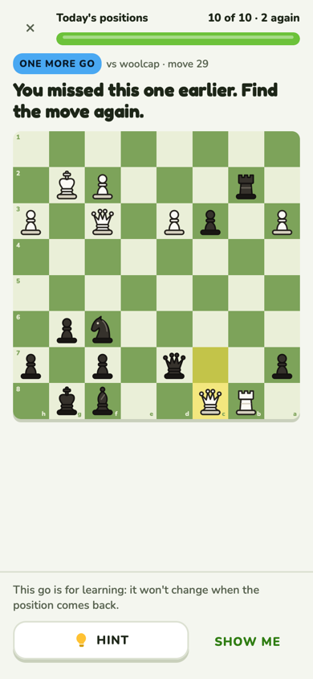
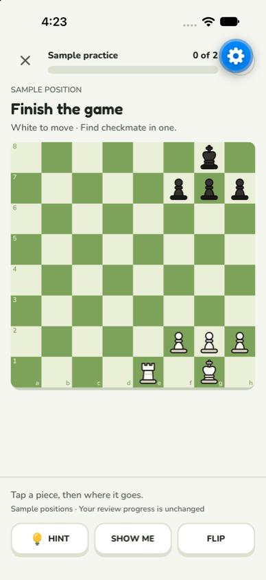
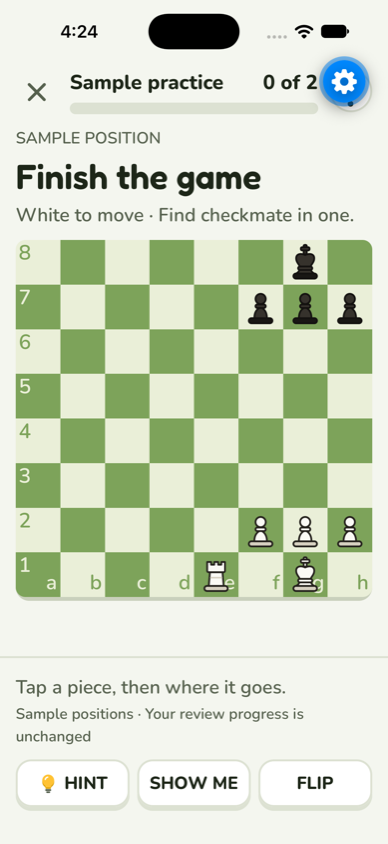
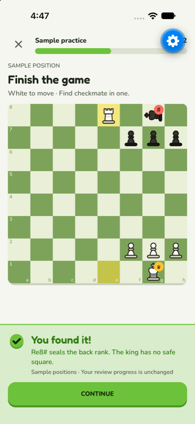

# Practice

Today's positions from your own games: find the move you missed. A lesson, full screen, no
navigation. Puzzles (`/puzzles`) use the same screen and rules.

**Code:** `web/src/pages/practice.tsx`, `pages/puzzles.tsx`, `components/lesson-bar.tsx`,
`components/find-bar.tsx`, `lib/find-move.ts`; scheduling in `deck.py`. **Built**
([#32](https://github.com/hunterrhansen/knightly/pull/32), Easy in
[#40](https://github.com/hunterrhansen/knightly/pull/40), FSRS tuning in
[#41](https://github.com/hunterrhansen/knightly/pull/41)). Rules in design.md › Lessons.

| Try again and Hint | Every bar and its grade |
| --- | --- |
|  |  |

| Done for today | Phone: right answer | Phone: one more go |
| --- | --- | --- |
|  |  |  |

## Layout

- **Top:** ✕ (back Home) and the progress bar, "3 of 10".
- **Prompt:** pills (New or One more go, the game it came from, the move's badge), then the
  heading "You played Qxc8 here. Find a better move." and a line with the side to move and
  your winning chance then.
- **Board**, as big as the space left. Tap or drag a piece; legal moves show as dots and rings.
- **Bar along the bottom:** Skip and a line of help before you answer; the verdict after.
- **Done for today:** a check medal, "10 positions reviewed. 7 right, 3 back tomorrow", a row
  of marks with the misses named, and tiles for Mastered, Learning, Not seen yet. See your deck
  and Back home.

## Forgiving practice (decided Oct 7, replaces "one answer a day")

Why: learning beats engagement. Only 1 of the first 10 Practice answers was right, and each
miss was a dead end.

- **Try again:** a wrong move slides back: "Not quite. Try again, or use a hint."
- **Hint,** two steps as on Lichess: Hint lights up the piece to move, then the button becomes
  Show the move and draws the arrow. When the position has a tactic, a first step names it
  ("Look for a fork…"). Live two seconds after the position appears (Chess.com's top complaint
  is accidental taps). Show me stays separate and gives the answer.
- **One more go:** positions you didn't get on the first try come back once at the end of the
  session. The session ends when each is solved; that go doesn't change the grade.

## Grades

FSRS, the scheduler Anki uses by default (chosen over SM-2), with default settings until there
are a few hundred reviews; `knightly fsrs-optimize` tunes it after 512. The app presses Anki's
buttons for you, from your **first try only**:

| First try | Grade |
| --- | --- |
| The engine's move within 10 s, no hint | Easy |
| Best, or within ~2 points of win chance | Good |
| Within ~5 points ("Good move! Best was …") | Hard |
| Right on a retry, after a hint, or shown the move | Again |

Any checkmate counts as best. The same rules apply to the review lesson's find steps and to
Puzzles (nothing is sent to Lichess).

The Done for today picture still says "mastered after 4 right in a row"; that line predates
FSRS, so take the wording from the app.

## Expo lesson shell — October 9, 2026

Sample and connected practice now share `mobile/src/components/lesson-screen.tsx`.
The active lesson is a full-height flex layout with no ScrollView: × exits to Home,
the header contains session progress, the prompt sits above the board, and feedback
and actions stay in a full-width band above the bottom safe area. The board fits
both available width and remaining height, including its 4px ledge. The prompt
and Hint provide guidance without a header question mark. Appearance
controls remain in Settings.

Hint (with the brand bulb), Show me and Flip live in the idle/retry band. Correct
answers replace them with a green verdict and Continue; showing the move uses the
red verdict and Continue. Hints unlock after two seconds. The connected flow keeps
the existing server answer/hint calls, first-attempt grading and end-of-session
redo queue. Sample practice is explicitly local and never updates the real deck.
Completion uses a concise summary and result marks instead of a scrolling list.

| iPhone: before answering | iPhone: larger text |
| --- | --- |
|  |  |

The floating blue gear is Expo Go's development overlay, covering part of the header;
it is not part of the lesson design. Native captures were checked at normal and
accessibility-large text. Text in the bounded lesson chrome scales up to its local
limit; it does not disable system text scaling globally.

The shared flow was exercised through React Native Web at 390×844 and 320×568:
wrong move and reset, recovery with the correct move, Continue, Show me, completion,
and × exit to Home. The short-screen document height stayed at 568px, with actions
inside the viewport. The same sample flow passed in the iPhone 18 Pro simulator:
wrong move and automatic reset, correct recovery, Continue to the next position,
Show me, completion, and × exit back to Home. Connected grading and network failure
recovery were not replayed against an account.
Lint, typecheck, all 16 existing tests and the Expo web export passed.

### Motion follow-up

The question mark is removed; the prompt and Hint provide lesson guidance.
Practice keeps the default iOS push/pop transition and immediate feedback/progress
updates. The experimental fade, verdict entrance and progress-fill animations
were reverted after device review. Refine motion in a later design pass.

### References checked

- The web `LessonScreen`, `LessonBoard`, `LessonBar` and `FindBar`, plus the phone
  screenshots above, are the direct layout reference and brand source.
- [Duolingo's lesson examples](https://blog.duolingo.com/duolingo-101-how-to-learn-a-language-on-duolingo/)
  provide the focused exercise and answer-control structure. Knightly retains its
  own task, typography, icons and feedback rules.
- [Chess.com's Daily Puzzle flow](https://support.chess.com/en/articles/8708990-how-does-the-daily-puzzle-work)
  provides a board-centered solving and hint reference. Knightly's no-scroll,
  bottom-band layout follows its existing practice specification; it does not add
  Chess.com's hearts, subscriptions or puzzle economy.
