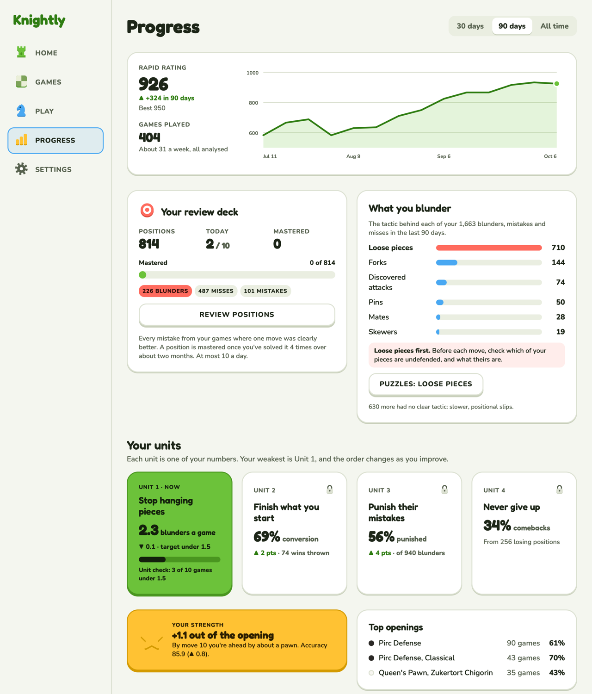
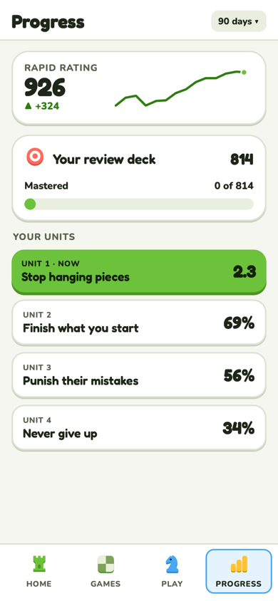

# Progress

How you're doing: rating, your review deck, what you blunder, your units, openings.

**Code:** `web/src/pages/overview.tsx`, `components/unit-card.tsx`; tactics from
`patterns.py`. **Built.** Rules in design.md › Screens › Progress.

| Desktop | Phone |
| --- | --- |
|  |  |

## Layout

- **Range:** 30 days / 90 days / All time, top right (Settings picks the default).
- **Rating card:** the rating, its change and best, games played, and the rating over time.
- **Your review deck:** positions, today's count (`2 / 10`), mastered; a Mastered bar; the
  deck split by kind (blunders, misses, mistakes); Review positions.
- **What you blunder:** the tactic behind each of your blunders, mistakes and misses as bars
  (Lichess theme names), the top one called out with a line of advice, and a button that opens
  puzzles for it, from Lichess's puzzle set (the same as Home's path step). The count with no
  clear tactic is a footnote.
- **Your units:** one card per KPI in Home's order. Unit 1 (the weakest) in brand with its unit
  check as a bar; the others plain with a lock, or a check once done. Each links to the games
  behind it.
- **Your strength** (gold, the page's one gold moment) and **Top openings**.

## Real or example

On the canvas, everything is real data from the owner's games except today's 2 of 10.
"What you blunder" is real: loose pieces lead by far (710 of 1,663 over 90 days).
