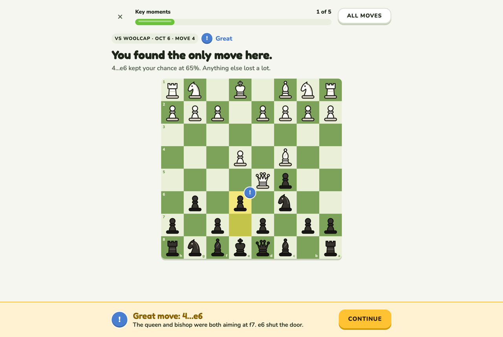
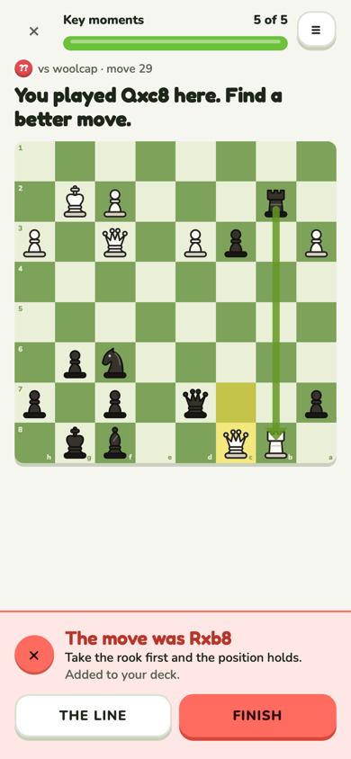
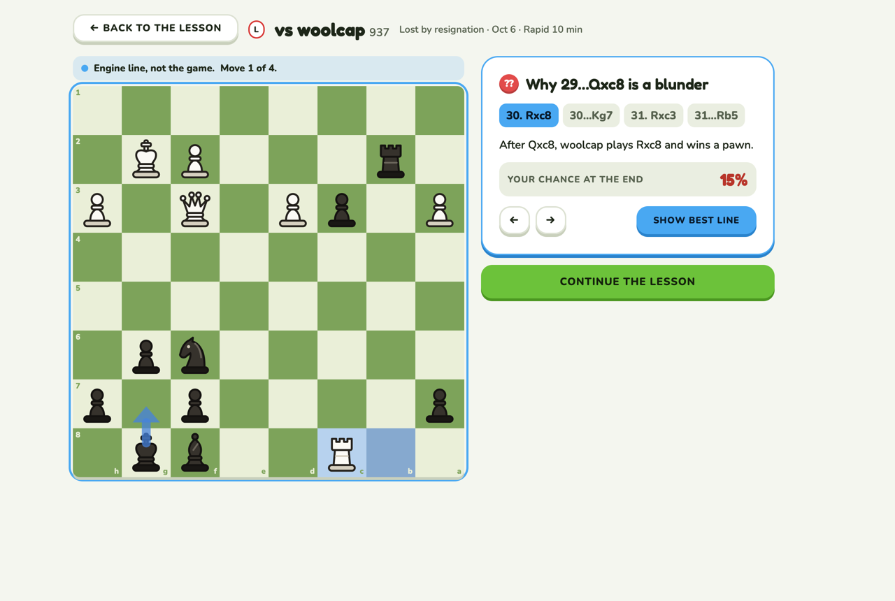
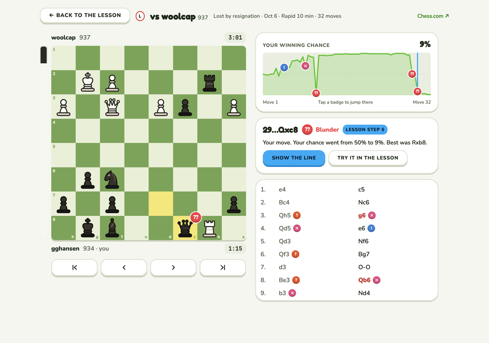
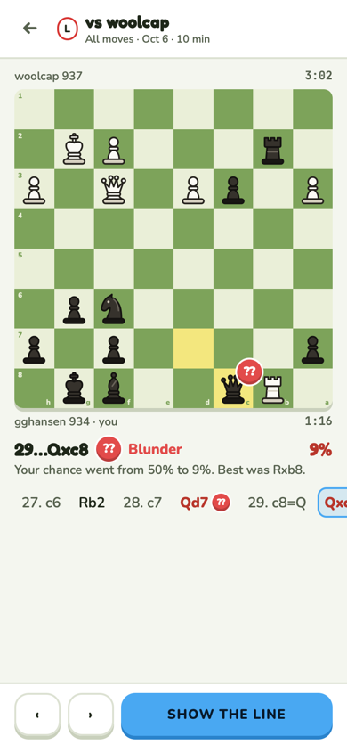
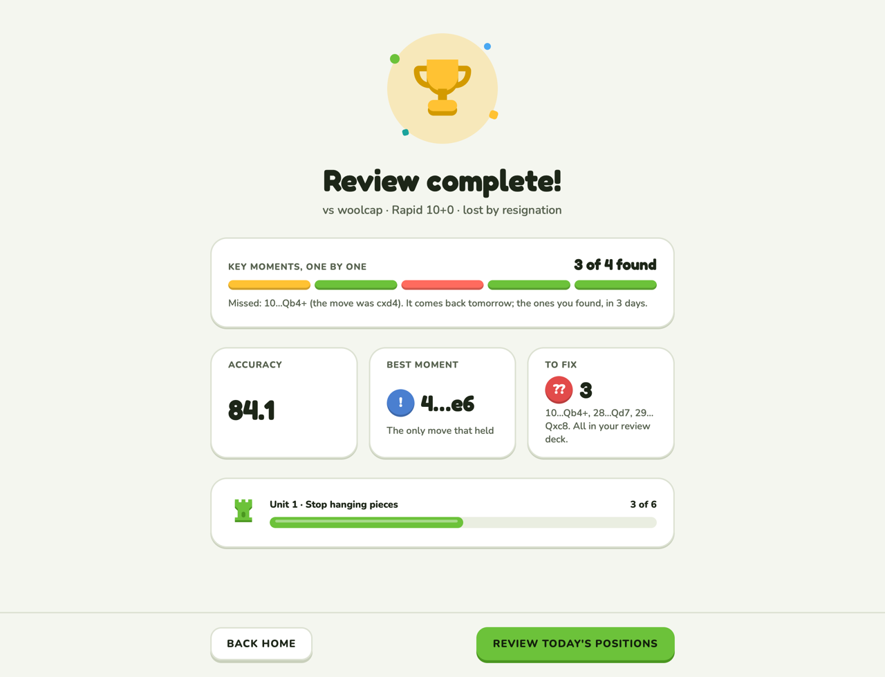
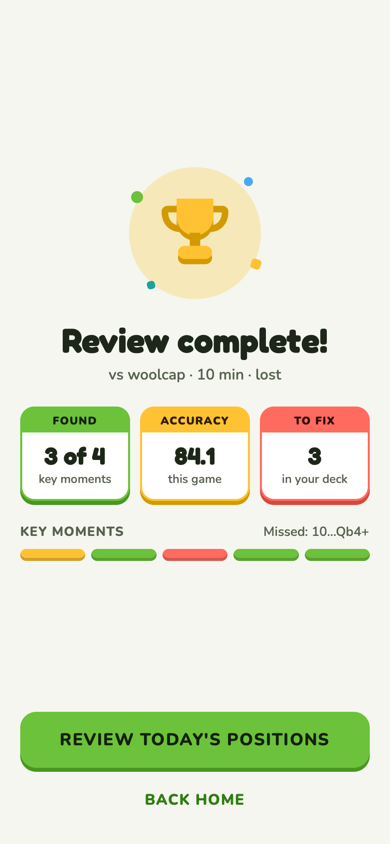
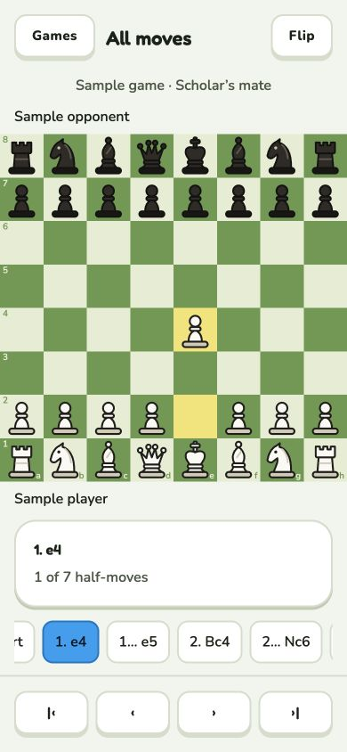
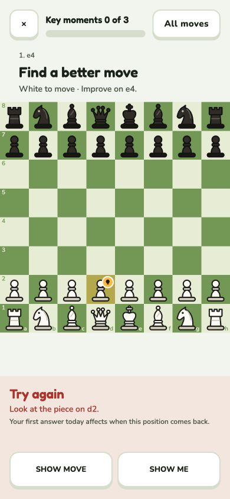
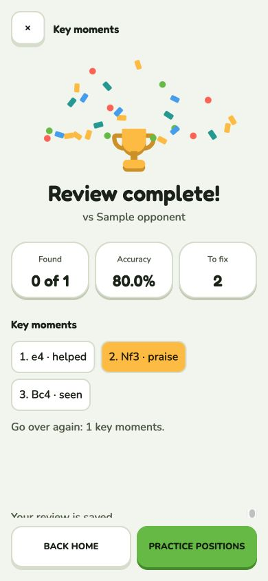

# Game review

A game's review is a lesson: one step per key moment, in the same shell as Practice. All moves
is the whole game for browsing. Review complete ends it.

**Code:** `web/src/pages/review.tsx` (the lesson), `pages/review-moves.tsx` (All moves),
`pages/review-done.tsx`, `components/review-bits.tsx`, `components/mark-row.tsx`. **Built**
([#28](https://github.com/hunterrhansen/knightly/pull/28),
[#29](https://github.com/hunterrhansen/knightly/pull/29)); variations in
[review-variations.md](../review-variations.md). Rules in design.md › Lessons.

| Phone: wrong answer | Show the line |
| --- | --- |
|  |  |

## The lesson

Focus mode: ✕ and the progress bar ("Key moments 1 of 5") on top, All moves top right, one
column, the prompt as a big heading, the board, and the bar along the bottom with Continue.

Each of your key moments is one step:

- **Your mistake, miss or blunder** → "Find a better move". You play it on the board. Right:
  green bar, "Found it". Wrong or Show me: red bar, the answer as a green arrow. Either way the
  why. Hint and try again work as in Practice.
- **Your Great or Brilliant move** → a gold "Great move" bar, no question.
- **No single move fixes it** → the step shows what happened instead of asking.
- **Show the line** opens line mode (blue frame, blue highlights), full screen, with Continue
  the lesson.
- The last step's button is **Finish review** → Review complete.

Not in the lesson: nav, eval bar, clocks (they live in All moves).

### Decisions (Oct 7)

1. Finding the move counts as that position's first answer in the deck (found → back in
   3 days, missed → tomorrow).
2. An opponent's ≥20-point win-chance drop creates a lesson at your reply, describing whether you punished it or let it slide. The reply appears once; the opponent's move itself stays in All moves.
3. Review complete gets one mark per key moment (gold for a great move) and "3 of 4 found".
4. All moves is full screen.

## All moves

| Desktop | Phone |
| --- | --- |
|  |  |

- Board with the eval bar and both clocks; start, back, forward, end under it.
- **Win graph:** your winning chance over the game; the lesson's key moments sit on it as
  badges (tap to jump); a blue line marks where you are.
- **The current move:** its badge, your chance before → after, the best move when it went
  wrong. Show the line opens line mode; a lesson step also offers Try it in the lesson.
- **Move list:** your bad moves in red with their badge, the opponent's moves greyed.
- **Phone:** board on top, the current move, a sideways-scrolling move strip, ‹ › and Show the
  line along the bottom.
- No note box: notes were removed from the app.

## Review complete

| Desktop | Phone (no scrolling) |
| --- | --- |
|  |  |

- Trophy, "Review complete!", the game in one line.
- **Key moments, one by one:** a mark per step and "3 of 4 found", with what you missed and
  when it comes back.
- Tiles: Accuracy, Best moment, To fix. Then the unit's bar.
- Review today's positions (brand) and Back home.
- **Phone:** one screen, no scrolling, like Duolingo's lesson complete: trophy and title, three
  tiles with a colored band (Found green, Accuracy gold, To fix red), the marks row, one big
  button and Back home. The best-moment card and the unit bar are left out. Checked at 375 × 812
  and 375 × 667.

## Mobile read-only replay — October 10, 2026

**Code:** `mobile/src/screens/game-replay.tsx`, `mobile/src/lib/game-replay.ts`.
The initial replay slice opened All moves on both game routes. The guided slice below now owns `/games/[id]`; `/moves` retains replay. Opening or stepping
through a game does not submit answers or mark it reviewed.

The phone layout has Games/All moves/Flip in its header, player names and the
read-only board, the current move and half-move count, a horizontal selectable
move strip, and pinned first/previous/next/last controls. The square board spans
the full screen width with no rounded corners or bottom ledge; its size is not
capped by screen height. Player names and other content keep their 16px inset.
The move strip scrolls horizontally with its scrollbar hidden. Content can scroll on
short screens while navigation stays reachable. Games exits to the library,
including when replay was opened through a deep link. The initial board faces
the user's side; Flip changes board orientation and player ordering.

Authenticated replay uses the existing game-detail endpoint and its SAN list,
which is present before analysis. Custom starting positions retain their side
and full-move numbering. Last-move squares follow the selected position. Available
classification and best-move text are shown for the matching analysed move.
An unconfigured app offers a labeled sample game through Games. Failed account
requests show an error/retry; they never switch to sample data.

States include loading, invalid link/not found/API failure, empty recorded game,
and content. A corrupt starting FEN shows an error without substituting another
board. A malformed SAN move stops at the last valid position with an explanation.
The screen intentionally defers clocks, evaluation/history graphs, engine lines,
variations to follow-up slices.

Browser interaction checks passed at 390×844, 320×568 and desktop width for navigation bounds,
move selection, checkmate, flip, Games exit and small-screen action reachability.
A temporary local fixture exercised failed loading followed by retry, Black's
initial orientation, no moves, invalid links and invalid FEN; the fixture was
removed. Chess-logic tests cover custom FEN/numbering, unanalysed replay, castling,
en passant, underpromotion and malformed moves. Native simulator interaction
could not run because the Mac was locked; connected account replay and physical
accessibility remain acceptance checks. Mobile lint, typecheck, all 71 tests, token
consistency and iOS/web exports passed. This picture is React Native Web.

## Mobile guided review — October 10, 2026

**Code:** `mobile/src/screens/game-review.tsx`, `review-position.tsx`,
`game-review-done.tsx`; `mobile/src/lib/review-{lesson,session,attempt,flow,completion}.ts`.

| Guided lesson (browser, 390×844) | Saved results (browser, 390×844) |
| --- | --- |
|  |  |

The game route selects find/look/praise steps with the web's two-pass algorithm.
Find uses the position before the move, with an answer-free prompt; look and
praise use the played position. The board stays square, full width, without a
radius or ledge. Content scrolls while the hint/answer/Continue footer stays pinned.
All moves opens at the lesson ply and returns to the same lesson without advancing.
Exit returns to Games and retains unfinished progress.

Tap or drag a legal move; promotion offers Queen, Knight, Rook and Bishop.
Only the server decides correctness. A wrong answer leaves the original position
and permits retry. Hints appear after two seconds and advance tactic/piece/move;
failed hint requests retry the same rung. Show me submits the existing `0000`
answer. Accepted first answers become found/good; help or earlier attempts become
helped; Show me becomes missed. Praise/seen are recorded only on Continue.
An optional engine summary loads after resolution or on look; failure offers retry
and never blocks continuing. Interactive engine lines remain deferred.

Progress is stored by API/user, game and exact analysis fingerprint. Interrupted
answers resume conservatively, with help/attempt history retained; they cannot
become first-try successes. An unresolved old-day position requires Restart.
Storage failures leave a visible warning and permit solving in memory. Finish
requires storing the exact pending marks before sending; if local storage is
unavailable, it retains those marks in memory and exposes retry.

Only **Finish review** saves the game. An ambiguous save is accepted only when a
fresh detail read has identical ordered marks and a changed review timestamp.
Otherwise the lesson remains open for retry. The Done route only reads saved
detail; it never writes. Results show Found/Accuracy/To fix and labeled marks,
including helped/missed separately. Celebration follows confirmed Finish and
respects Reduce Motion. Quiet games explicitly finish with an empty mark set.
Missing analysis, unknown side or inconsistent SAN/analysis retain replay access
and block grading/completion. Sample mode remains a labeled read-only replay.

Verification: browser fixtures exercised wrong→hint→solve, All moves return,
reload/resume, praise/look→Finish→saved results, and knight underpromotion with all
four choices visible. Fixtures and session overrides were removed. Native Device
Hub controls did not respond; no guided native or real-account journey is claimed.
Physical-device drag, VoiceOver, large text, Reduce Motion and connected
lost-response recovery remain release acceptance checks. The backend must ship
`server_day` and the backward-compatible `expected_day` guard before this client.
