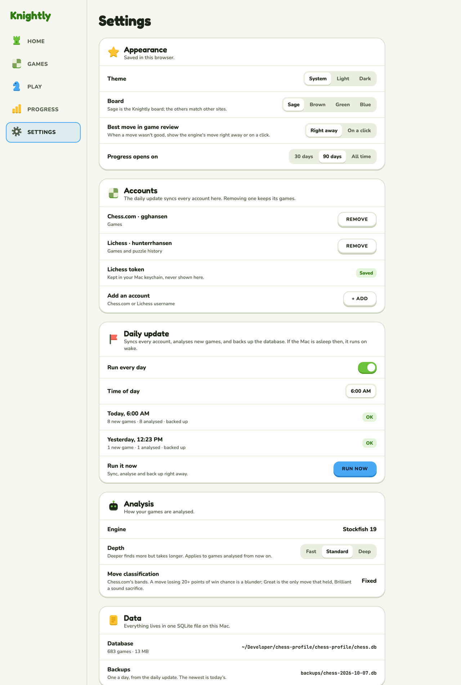

# Settings

Every option, in five sections.

**Code:** `web/src/pages/settings.tsx`. **Built.** Rules in design.md › Screens › Settings.
Your data and Admin are in [account.md](account.md).

## Layout

Each section is a card with its KnIcon, title and a line of what it's for, then rows: the name
and a hint on the left, the control on the right. Choices are segmented controls; on/off is a
switch.

1. **Appearance and sound:** theme, board (Sage is the Knightly board and the default; Brown,
   Green, Blue match other sites), best move in game review (right away / on a click), Progress
   opens on (30 days / 90 days / All time), and the Sounds switch (in the app, not drawn).
2. **Accounts:** each linked account with Remove, the Lichess token's status, Add an account.
   Signed in: the account's email and Sign out.
3. **Daily update:** run every day, time of day, the last runs with their result, Run now.
4. **Analysis:** engine (Stockfish), depth (Fast / Standard / Deep), move classification
   (fixed: Chess.com's bands).
5. **Data** (local only) or **Your data** (on a server): see [account.md](account.md).

## Decisions

- Same sections and options as before, new look.
- "Overview opens on" became "Progress opens on".
- **No phone design:** Settings is rarely visited on a phone; it stacks into one column.
