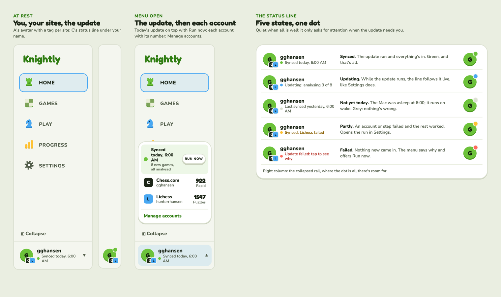
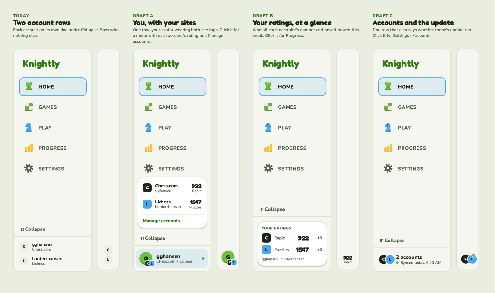
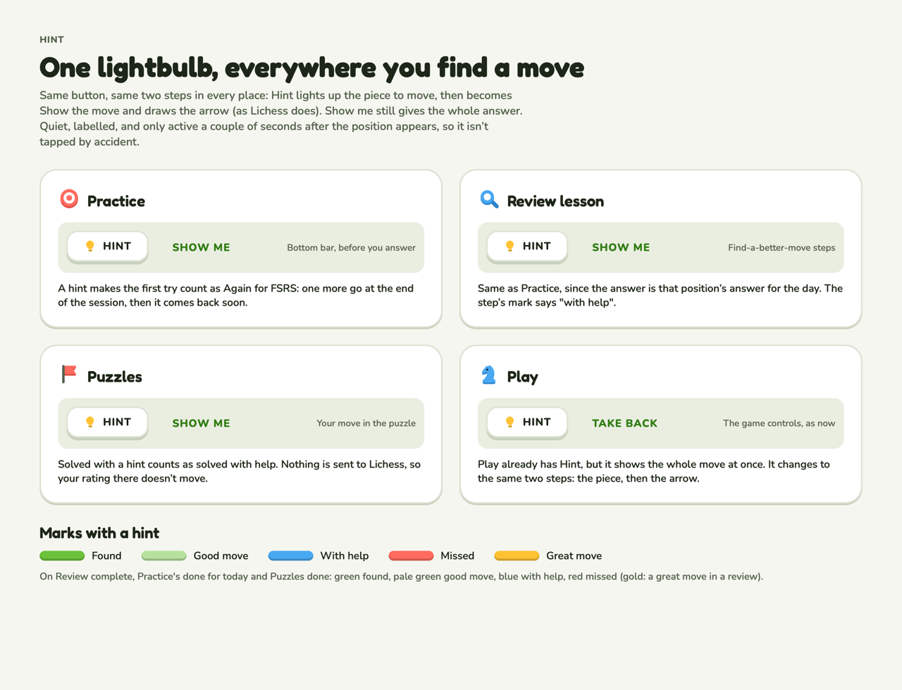
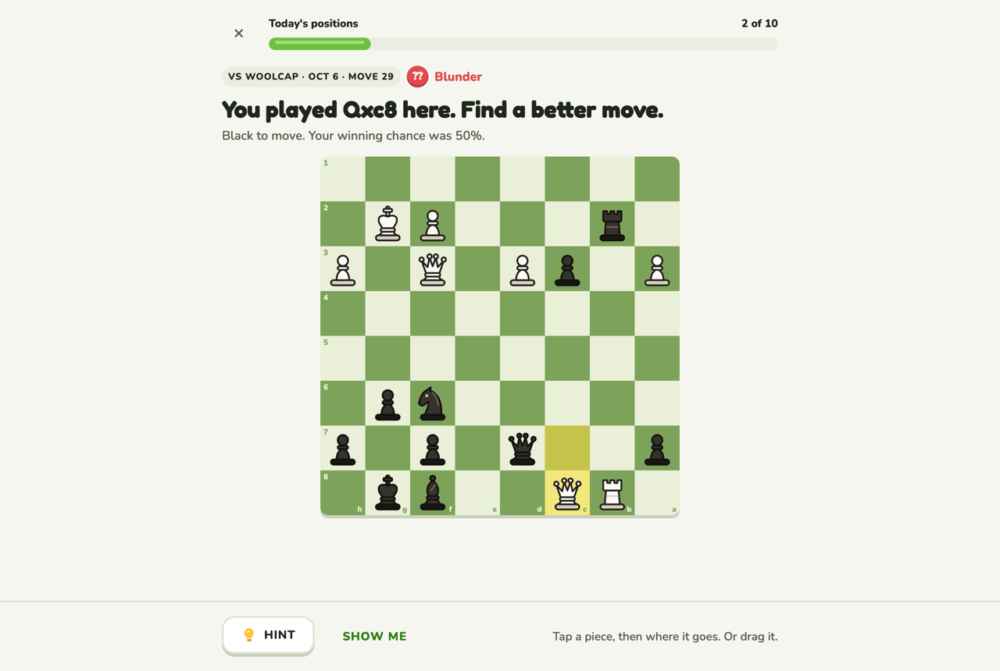
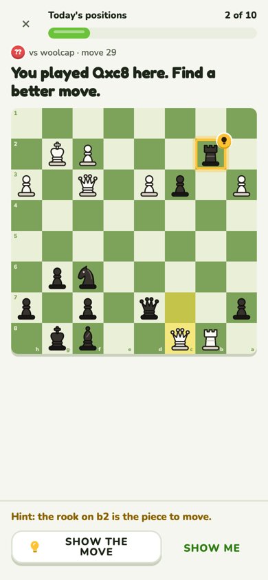

# The shell: navigation and the account row

What surrounds every signed-in page.

**Code:** `web/src/components/app-shell.tsx`, `components/account-status.tsx`. **Built**
([#33](https://github.com/hunterrhansen/knightly/pull/33)). Rules in design.md › Navigation.

## Navigation

Tabs: Home · Games · Play · Progress · Settings. On desktop a sidebar (collapsible to an icon
rail); on a phone a top bar with the Settings gear and a tab bar along the bottom (Home, Games,
Play, Progress). The current tab is outlined in sky. Lessons (Practice, Puzzles, review,
Welcome) are full screen with no navigation; their ✕ goes back Home. Every desktop picture in
this folder shows the sidebar; every phone picture shows the tab bar.

## The account row

At the foot of the sidebar: your initial on a brand disc wearing a small tag per site
(Chess.com ink, Lichess sky), your name, and under it the daily update as a dot and a line
("Synced today, 6:00 AM"). Collapsed to the rail, the dot sits on the avatar.

Click it for a menu: today's update on top with Run now, then each account with its rating,
then Manage accounts (Settings).

| Dot | State | When |
| --- | --- | --- |
| green | Synced | The update ran and everything's in. |
| sky, pulsing | Updating | Follows the run live ("analysing 3 of 8"). |
| grey | Not yet today | The update hasn't run yet today. Nothing's wrong. |
| gold | Partly | An account or step failed and the rest worked. |
| red | Failed | Nothing new came in; the menu says why and offers Run now. |

### Options considered

A (avatar with site tags and a menu), B (a ratings card) and C (accounts plus the update's
status). Chosen: A with C's status line.

## Hint, everywhere

| In Practice | Phone |
| --- | --- |
|  |  |

One quiet button with the gold bulb (`KnIcon hint`), the same two steps in Practice, the review
lesson, Puzzles and Play. Marks show a paler green for "found with a hint". Details and grading
in [practice.md](practice.md).
